---
hide:
  - toc
---

# Diagram Gallery

The system diagrams, collected from across the documentation. Each image links to the full-size SVG; the noted section carries the surrounding description.

### The ePIC Computing Model

In [Foundations](foundations.md) — the Echelon model: E0 detector and DAQ, the butterfly raw-data fan-out to the E1 host labs, E2 global facilities, and E3.

[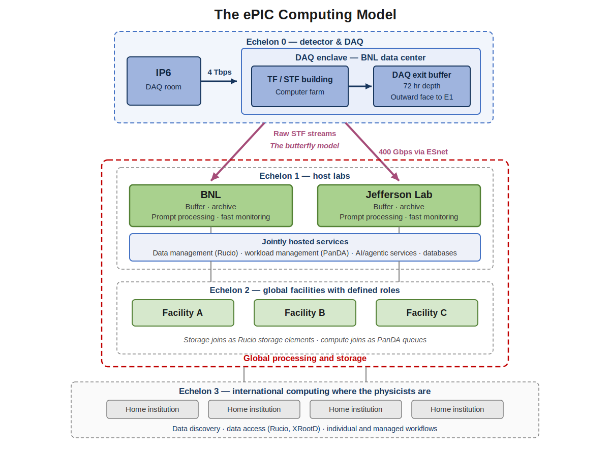](diagrams/epic_computing_model.svg)

### Lifecycles

In [Concepts](concepts.md) — the state machines of the campaign task (with PanDA tail retry and operator rerun controls), the campaign staging, and the tag lock.

[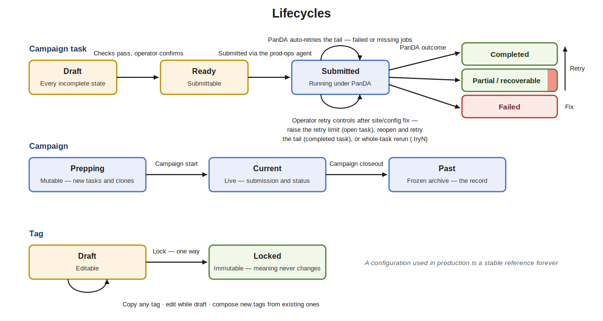](diagrams/lifecycles.svg)

### The ePIC Workflow Management System

In [Architecture](architecture.md) — the platform anchor: workflow domains served by shared web/database, agent, AI, data and workflow management layers over the Echelon resources.

[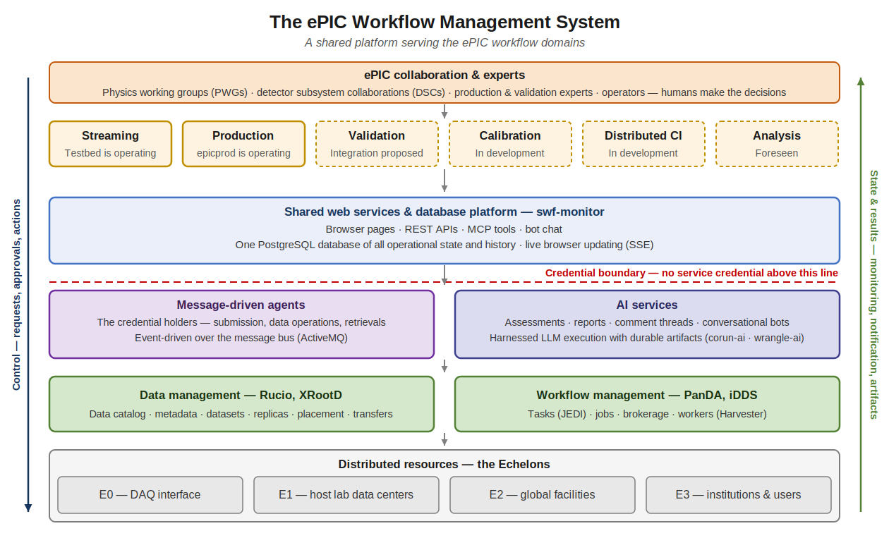](diagrams/wfms_platform.svg)

### PanDA in ePIC

In [WFMS Platform](platform.md) — the deployed workload management infrastructure: the two fronts driving PanDA at BNL, identity, the ePIC monitor, and the growing resource landscape.

### ePIC AI Infrastructure Stack

In [WFMS Platform](platform.md) — ePIC services, the MCP instrumentation over them, and the AI services built on top.

### corun-ai — LLM Execution and Artifact Service

In [WFMS Platform](platform.md) — the corun-ai system: an interactive research site and the REST AI back end of the WFMS, sharing one execution machinery and artifact store.

### LLM and Automated Services in epicprod

In [WFMS Platform](platform.md) — human-gated LLM assistance and credentialed automation.

### E0-E1 Workflow Schematic

In [Streaming Workflows](streaming.md) — the E0-E1 interface: DAQ exit buffer, STF and TF streams to the E1 facilities, and the streaming workflow testbed scope.

[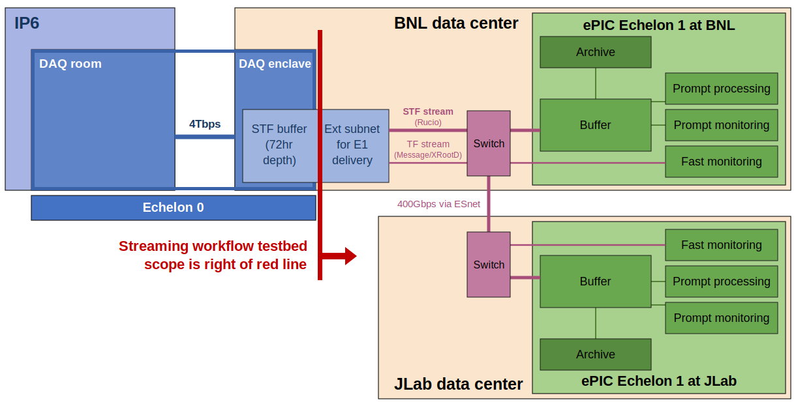](diagrams/E0-E1_workflow_schematic.svg)

### Prompt Processing Workflow

In [Streaming Workflows](streaming.md) — full-sample processing of every STF as it arrives, from run signals through the filling run dataset to PanDA jobs at the E1s, with the conceptual decision box.

[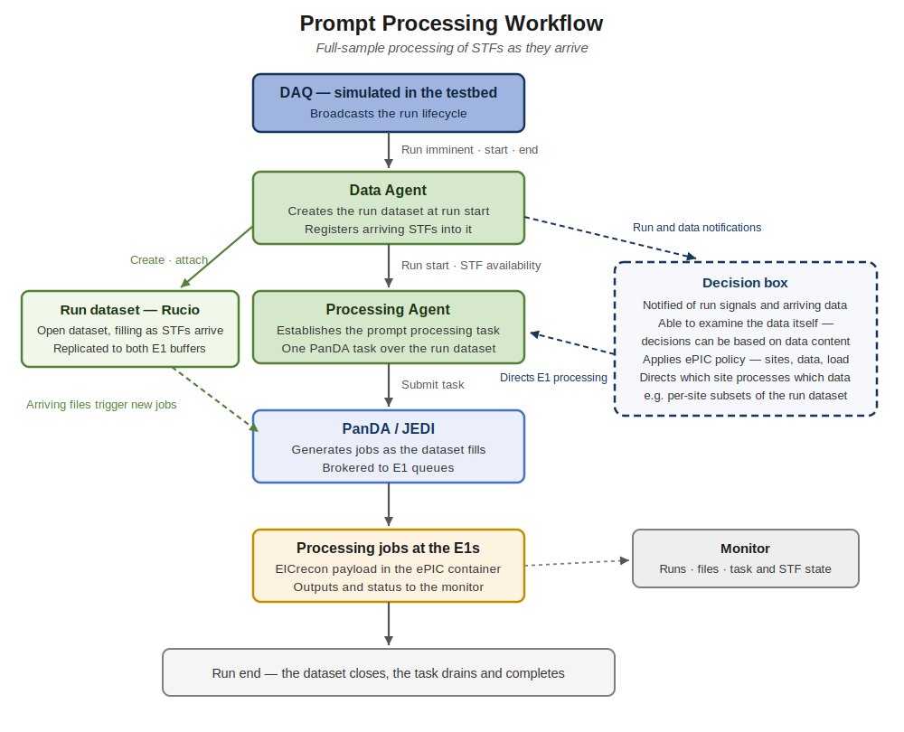](diagrams/prompt_processing_workflow.svg)

### Fast Processing Pipeline

In [Streaming Workflows](streaming.md) — the testbed fast-processing pipeline from simulated DAQ through TF slices to the standing worker pool.

[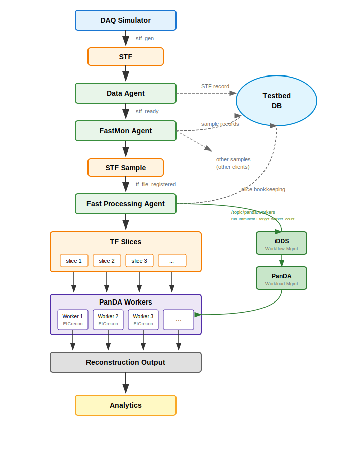](diagrams/fast-processing-pipeline-v10.svg)

### iDDS/PanDA/Harvester Detail

In [Streaming Workflows](streaming.md) — worker provisioning behind the fast-processing pool.

[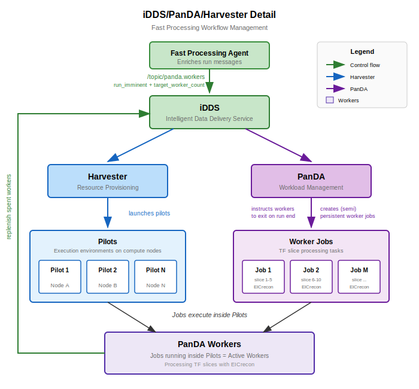](diagrams/idds-panda-detail-v1.svg)

### Testbed Agent Management

In [Streaming Workflows](streaming.md) — how testbed agents are configured, launched, and supervised: CLI and MCP control, the per-user agent manager, and supervisord.

[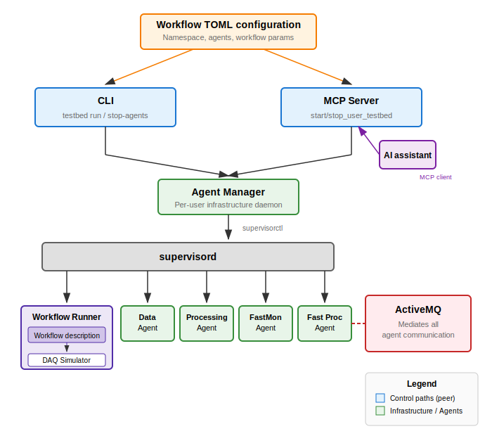](diagrams/testbed_agent_management.svg)

### Testbed Multi-User Isolation

In [Streaming Workflows](streaming.md) — shared infrastructure with independent per-user operation: namespaces, per-user agent identity, and filtered views.

[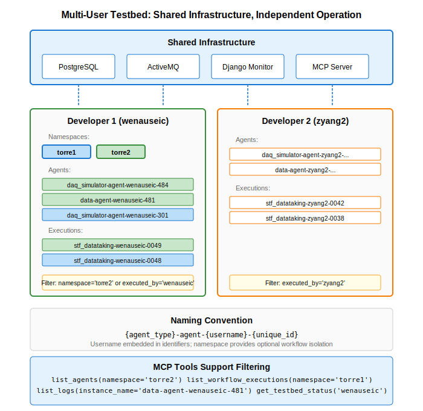](diagrams/testbed_multi_user.svg)

### epicprod — the ePIC Production System

In [Production System](production.md) — the production workflow stages, LLM services, and credentialed operations of epicprod.

[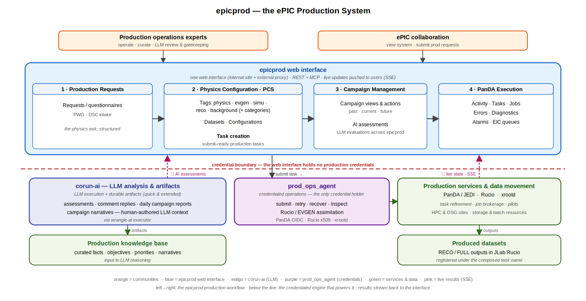](diagrams/epicprod_system.svg)

### ePIC Automated Production Workflow

In [Production System](production.md) — the production workflow and the task catalog staged by campaign lifecycle.

[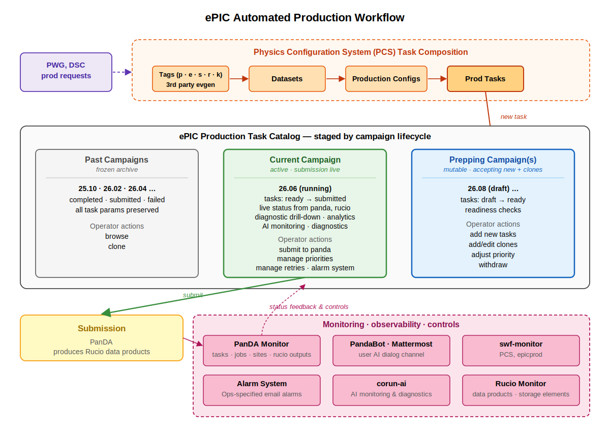](diagrams/epicprod_task_catalog.svg)

### ePIC Production Dataflow

In [Production System](production.md) — job orchestration and the payload-handled science data path against JLab Rucio.

[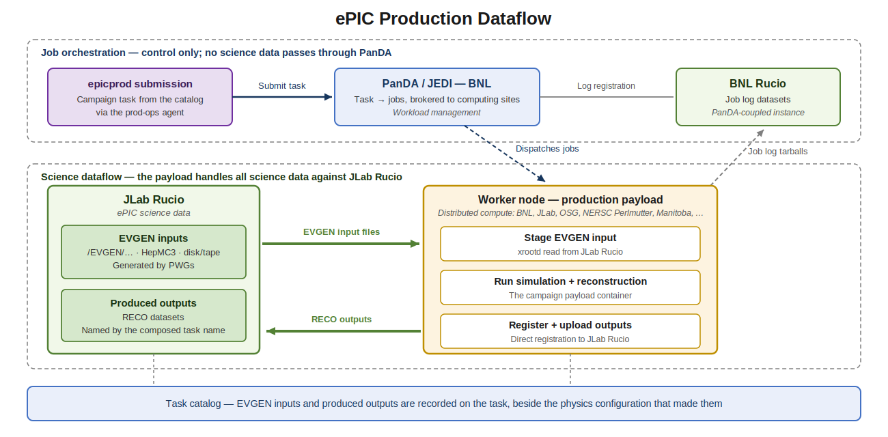](diagrams/epicprod_dataflow.svg)

### LLM and Distributed Computing Services Integration — Detailed Architecture

In [Production System](production.md) — the detailed LLM operations architecture: SSE relay, LLM executors, credentialed agent, and artifact store.

[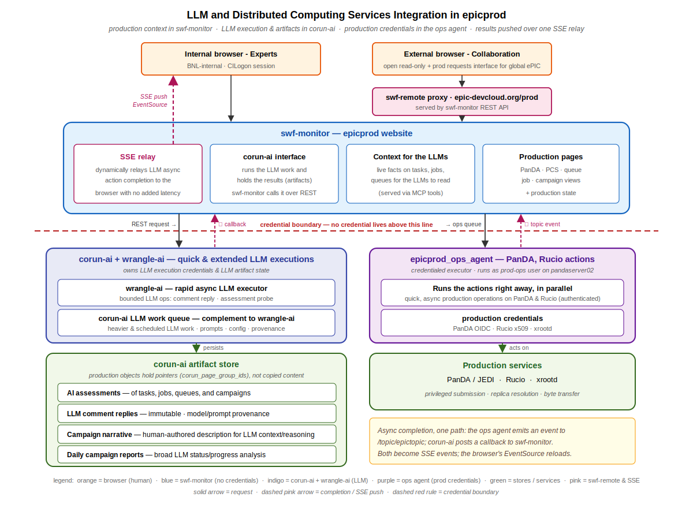](diagrams/epicprod_llm_ops_architecture.svg)

### The Validation Loop

In [Validation](validation.md) — availability, Hydra validation, AI assessment, record, and expert signoff between the WFMS and the ePIC validation program; proposal-stage interfaces dashed.

[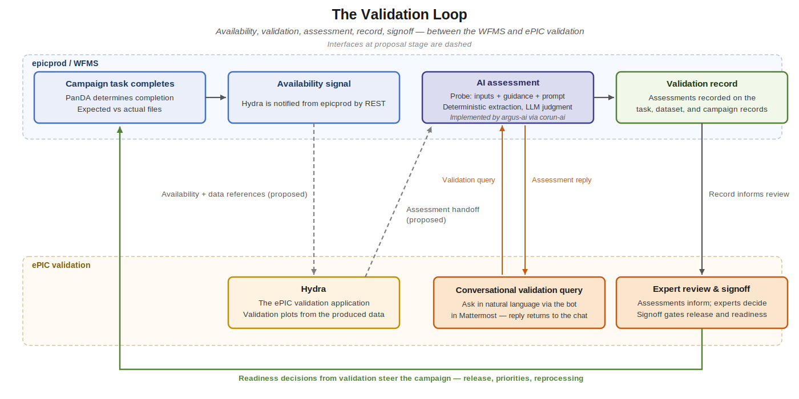](diagrams/validation_loop.svg)

### The WFMS Timeline

In [Timeline](timeline.md) — the three-year plan and the decade arc to physics datataking.

[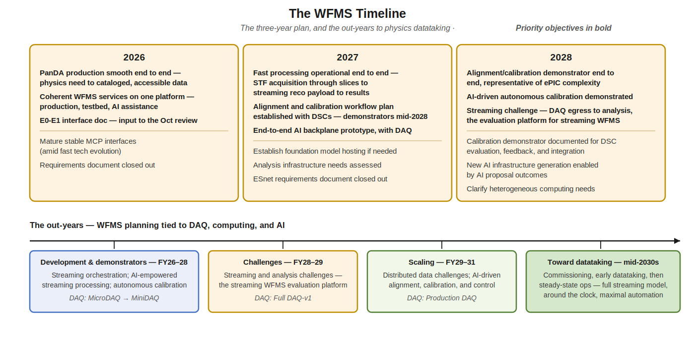](diagrams/wfms_timeline.svg)

### Streaming Computing Planning — FY25–FY31

In [Timeline](timeline.md) — the joint DAQ, computing, and AI planning lanes, the context for the WFMS out-years.

[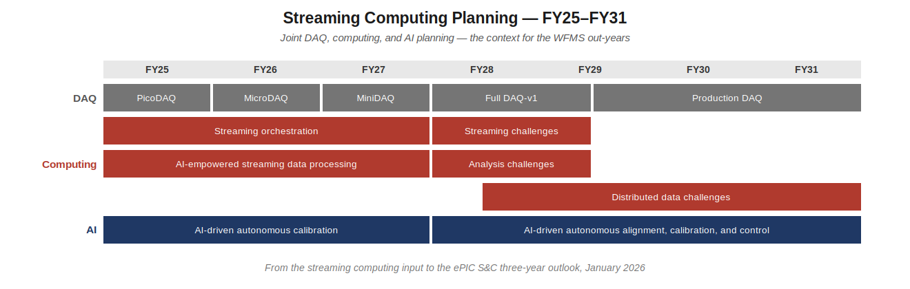](diagrams/streaming_planning_fy.svg)
