---
hide:
  - toc
---

# Diagram Gallery

The system diagrams, collected from across the documentation. Each image links to the full-size SVG; the noted section carries the surrounding description.

### The ePIC Computing Model

In [Foundations](foundations.md) — the Echelon model: E0 detector and DAQ, the butterfly raw-data fan-out to the E1 host labs, E2 global facilities, and E3.

[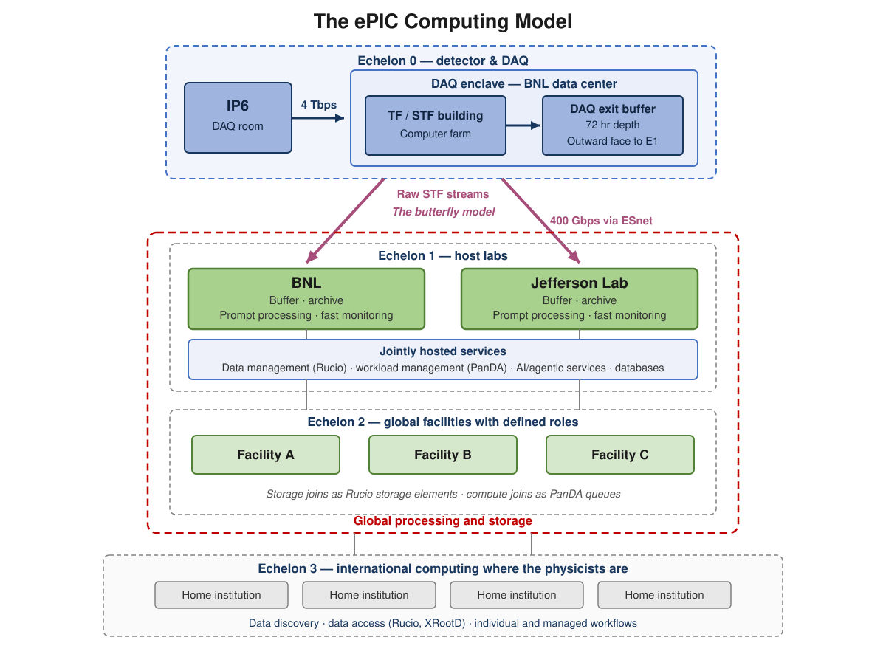](diagrams/epic_computing_model.svg)

<!-- AI-directed description of epic_computing_model.svg, hidden from the rendered page: the diagram content stated as text so it need not be re-inferred from the image.
This diagram depicts the tiered echelon architecture of ePIC computing, from detector readout to physicists' home institutions; it is the site's top-level computing model reference. Title: "The ePIC Computing Model"; no subtitle. Layout is a vertical stack of four echelon zones. At top, a blue dashed region "Echelon 0 — detector & DAQ" holds the box "IP6" (DAQ room), an arrow labeled "4 Tbps" into the enclosure "DAQ enclave — BNL data center", which contains "TF / STF building" (Computer farm) with an unlabeled arrow into "DAQ exit buffer" (72 hr depth; Outward face to E1). Two thick magenta arrows fan down-left and down-right from the enclave, jointly labeled "Raw TF/STF streams" and, in italics, "The butterfly model", with "400 Gbps via ESnet" beside the right arrow. A red dashed boundary labeled "Global processing, storage, and networking" encloses the next two tiers. "Echelon 1 — host labs" holds two green boxes, "BNL" and "Jefferson Lab", each reading "Buffer · archive" and "Prompt processing · fast monitoring"; both connect down to a blue bar "Jointly hosted services": data management (Rucio) · workload management (e.g., PanDA) · AI/agentic services · databases. Connectors lead to "Echelon 2 — global facilities with defined roles" with light-green boxes Facility A, Facility B, Facility C and the italic note "Storage joins as Rucio storage elements · compute joins as PanDA queues". Below the red boundary, "Echelon 3 — international computing where the physicists are" holds four gray "Home institution" boxes over the caption "Data discovery · data access (Rucio, XRootD) · individual and managed workflows". Blue denotes DAQ/services, green denotes processing facilities, gray denotes institutions. Takeaway: raw data streams from IP6 through a 72-hour exit buffer and fans out butterfly-style to two host labs, whose jointly hosted services federate global facilities and serve physicists everywhere.
-->

### The Streaming Latency Spectrum

In [Foundations](foundations.md) — result latencies across the streaming computing model, from real-time DAQ validation through fast results, prompt processing, validation, and calibration.

[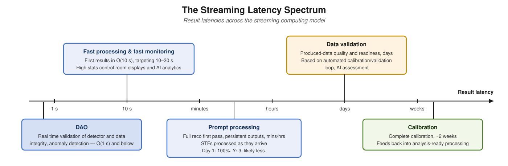](diagrams/latency_spectrum.svg)

<!-- AI-directed description of latency_spectrum.svg, hidden from the rendered page: the diagram content stated as text so it need not be re-inferred from the image.
This diagram depicts where each ePIC streaming computing activity sits on a logarithmic result-latency axis; it frames the streaming model as a spectrum of feedback timescales. Title: "The Streaming Latency Spectrum"; italic subtitle: "Result latencies across the streaming computing model". Layout: a single horizontal black axis arrow labeled "Result latency" runs left to right with tick marks at 1 s, 10 s, minutes, hours, days, and weeks; five activity blocks connect to the axis by short vertical lines, two above it and three below. Above the axis at 10 s, the blue box "Fast processing & fast monitoring": first results in O(10 s), targeting 10 to 30 s; high stats control room displays and AI analytics. Above the axis at days, the amber box "Data validation": produced-data quality and readiness, days; based on automated calibration/validation loop, AI assessment. Below the axis near 1 s, the darker blue box "DAQ": real time validation of detector and data integrity, anomaly detection — O(1 s) and below. Below the axis between minutes and hours, the blue box "Prompt processing": full reco first pass, persistent outputs, mins/hrs; STFs processed as they arrive; "Day 1: 100%. Yr 3: likely less." Below the axis beyond weeks, the green box "Calibration": complete calibration, ~2 weeks; feeds back into analysis-ready processing. Blue coloring marks DAQ/processing activities, amber marks validation, green marks calibration; there are no directional flows other than the axis itself. Takeaway: the streaming computing model spans sub-second DAQ integrity checks through ten-second fast monitoring, minutes-to-hours prompt processing, days-scale data validation, and a roughly two-week full calibration loop.
-->

### Lifecycles

In [Concepts](concepts.md) — the state machines of the campaign task (with PanDA tail retry and operator rerun controls), the campaign staging, and the tag lock.

[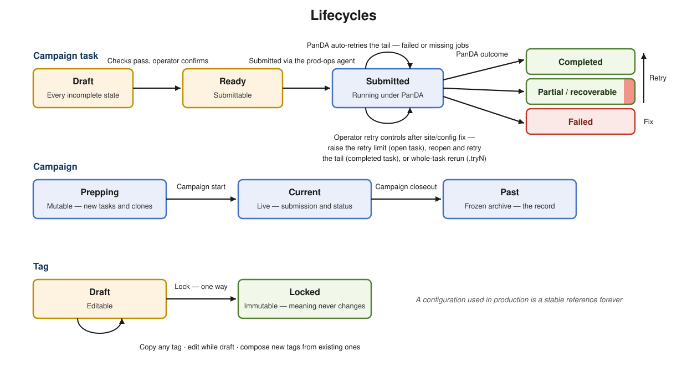](diagrams/lifecycles.svg)

<!-- AI-directed description of lifecycles.svg, hidden from the rendered page: the diagram content stated as text so it need not be re-inferred from the image.
This diagram depicts the three state machines governing epicprod objects: campaign tasks, campaigns, and tags; it documents lifecycle semantics for the production system. Title: "Lifecycles"; no subtitle. Layout: three horizontal lanes, each a left-to-right state chain. Lane one, "Campaign task": amber box "Draft" (every incomplete state) with arrow labeled "Checks pass, operator confirms" to amber box "Ready" (submittable), then arrow "Submitted via the prod-ops agent" to blue box "Submitted" (running under PanDA). Submitted has a self-loop above labeled "PanDA auto-retries the tail — failed or missing jobs" and a self-loop below labeled "Operator retry controls after site/config fix — raise the retry limit (open task), reopen and retry the tail (completed task), or whole-task rerun (.tryN)". Three arrows labeled "PanDA outcome" fan from Submitted to three outcome boxes: green "Completed"; "Partial / recoverable", drawn green with a thin red sliver on its right edge; red "Failed". At far right a vertical arrow runs upward from the Failed/Partial region toward Completed, annotated "Fix" at the bottom and "Retry" alongside, meaning a fix plus retry promotes failures upward. Lane two, "Campaign": blue boxes "Prepping" (mutable — new tasks and clones) then, via arrow "Campaign start", "Current" (live — submission and status) then, via arrow "Campaign closeout", "Past" (frozen archive — the record). Lane three, "Tag": amber "Draft" (editable), arrow "Lock — one way", green "Locked" (immutable — meaning never changes), with the italic note "A configuration used in production is a stable reference forever" and a loop under Draft labeled "Copy any tag · edit while draft · compose new tags from existing ones". Color semantics: amber mutable, blue active, green final/immutable, red failed. Takeaway: every epicprod object moves one way from mutable drafts to an immutable record, with retry loops confined to the PanDA-submitted state.
-->

### The ePIC Workflow Management System

In [Architecture](architecture.md) — the platform anchor: workflow domains served by shared web/database, agent, AI, data and workflow management layers over the Echelon resources.

[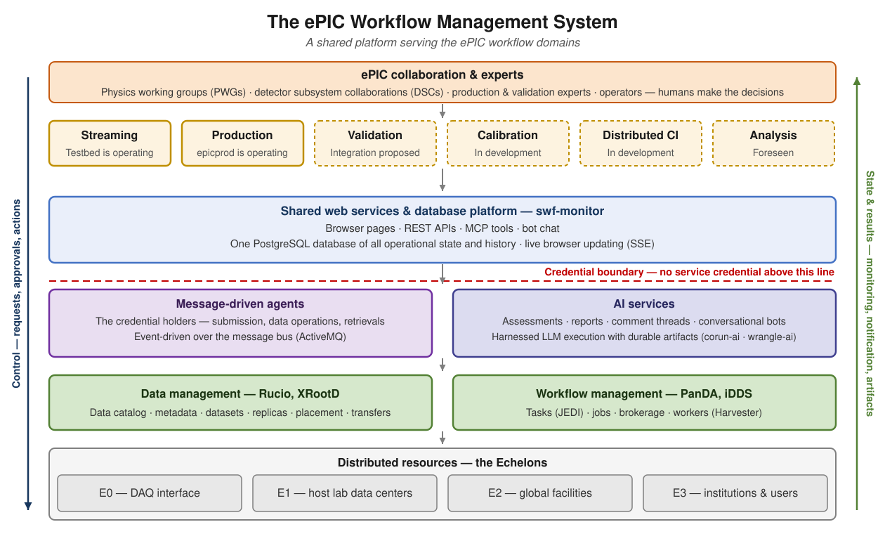](diagrams/wfms_platform.svg)

<!-- AI-directed description of wfms_platform.svg, hidden from the rendered page: the diagram content stated as text so it need not be re-inferred from the image.
This diagram depicts the full layered architecture of the ePIC WFMS platform, from humans down to distributed resources; it is the system's primary architecture picture. Title: "The ePIC Workflow Management System"; italic subtitle: "A shared platform serving the ePIC workflow domains". Layout: a vertical stack of layers joined by downward gray arrows, flanked by two vertical side rails. Top orange band "ePIC collaboration & experts": physics working groups (PWGs) · detector subsystem collaborations (DSCs) · production & validation experts · operators — humans make the decisions. Next, six amber workflow-domain boxes: "Streaming" (swf-testbed · operating) and "Production" (swf-epicprod · operating) with solid borders; "Validation" (integration proposed), "Calibration" (in development), "Distributed CI" (in development), and "Analysis" (foreseen) with dashed borders marking not-yet-operating domains. Next, the blue band "Shared web services & database platform — swf-monitor": browser pages · REST APIs · MCP tools · bot chat; one PostgreSQL database of all operational state and history · live browser updating (SSE). A red dashed horizontal line labeled "Credential boundary — no service credential above this line" separates the web tier from the layers below. Beneath it sit two boxes: purple "Message-driven agents" (the credential holders — submission, data operations, retrievals; event-driven over the message bus, ActiveMQ) and indigo "AI services" (assessments · reports · comment threads · conversational bots; harnessed LLM execution with durable artifacts, corun-ai · wrangle-ai). Next, two green boxes: "Data management — Rucio, XRootD" (data catalog · metadata · datasets · replicas · placement · transfers) and "Workflow management — PanDA, iDDS" (tasks (JEDI) · jobs · brokerage · workers (Harvester)). Bottom gray band "Distributed resources — the Echelons" with four boxes: E0 — DAQ interface; E1 — host lab data centers; E2 — global facilities; E3 — institutions & users. Left navy rail arrows downward, labeled "Control — requests, approvals, actions"; right green rail arrows upward, labeled "State & results — monitoring, notification, artifacts". Takeaway: one shared platform serves all workflow domains, with humans deciding at the top, credentials confined below the boundary, control flowing down and state flowing back up.
-->

### PanDA in ePIC

In [WFMS Platform](platform.md) — the deployed workload management infrastructure: the two fronts driving PanDA at BNL, identity, the ePIC monitor, and the growing resource landscape.

[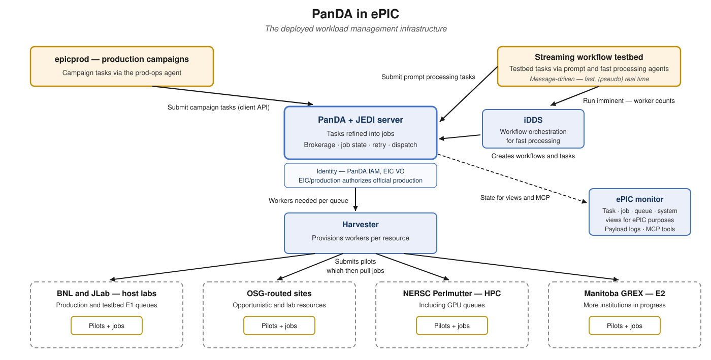](diagrams/panda_in_epic.svg)

<!-- AI-directed description of panda_in_epic.svg, hidden from the rendered page: the diagram content stated as text so it need not be re-inferred from the image.
This diagram depicts the concrete PanDA workload-management deployment serving ePIC, from the two ePIC drivers down to the computing sites; it complements the platform diagram with the deployed infrastructure view. Title: "PanDA in ePIC"; italic subtitle: "The deployed workload management infrastructure". Layout: two driver boxes at top, a central PanDA hub with satellites, and four site enclosures along the bottom. Top-left amber box "epicprod — production campaigns": campaign tasks via the prod-ops agent. Top-right amber box "Streaming workflow testbed": testbed tasks via prompt and fast processing agents; italic "Message-driven — fast, (pseudo) real time". Center blue hub "PanDA + JEDI server": tasks refined into jobs; brokerage · job state · retry · dispatch; with an attached identity strip reading "Identity — PanDA IAM, EIC VO" and "EIC/production authorizes official production". Right of the hub, blue box "iDDS": workflow orchestration for fast processing. Arrows: epicprod to the server labeled "Submit campaign tasks (client API)"; the testbed to the server labeled "Submit prompt processing tasks"; the testbed to iDDS labeled "Run imminent — worker counts"; iDDS to the server labeled "Creates workflows and tasks"; a dashed arrow from the server to the blue "ePIC monitor" box (task · job · queue · system; views tailored to ePIC; payload logs · MCP tools) labeled "State for views and MCP". A downward arrow labeled "Workers needed per queue" leads to blue box "Harvester": provisions workers per resource. Harvester fans four arrows, jointly labeled "Submits pilots which then pull jobs", to four dashed site enclosures, each containing a "Pilots + jobs" chip: "BNL and JLab — host labs" (production and testbed E1 queues); "OSG-routed sites" (opportunistic and lab resources); "NERSC Perlmutter — HPC" (including GPU queues); "Manitoba GREX — E2" (more institutions in progress). Takeaway: ePIC production and streaming drivers feed one PanDA/JEDI hub whose Harvester delivers pilots to host labs, OSG, HPC, and international sites.
-->

### PanDA System — As Operating in ePIC

In [WFMS Platform](platform.md) — the generic PanDA architecture in its ePIC operating context: task sources, JEDI and iDDS, the server hub, per-resource Harvesters and pilots, Rucio, monitoring, and AI assistance.

[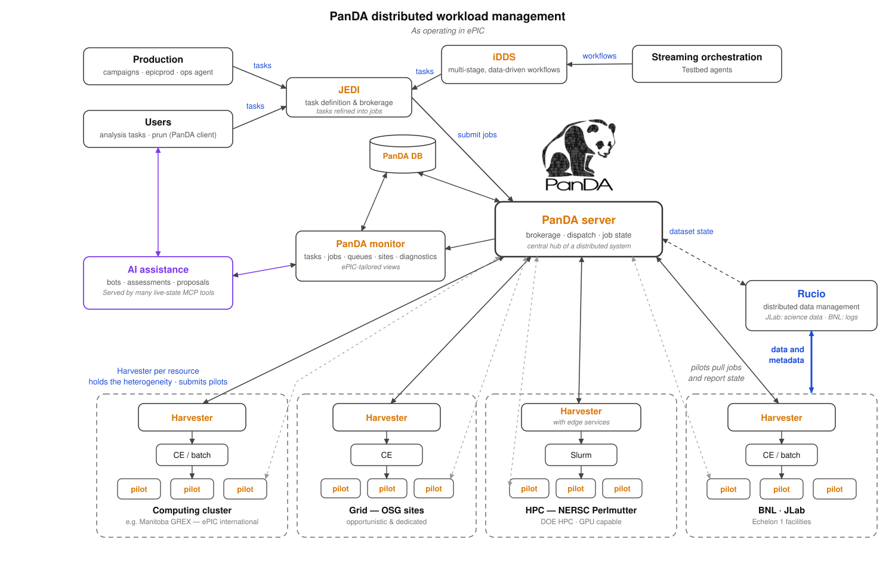](diagrams/panda_system_epic.svg)

<!-- AI-directed description of panda_system_epic.svg, hidden from the rendered page: the diagram content stated as text so it need not be re-inferred from the image.
This diagram depicts the internal architecture of the PanDA distributed workload management system as configured for ePIC, showing every component and control/data path; it is the detailed companion to the higher-level PanDA views. Title: "PanDA distributed workload management"; italic subtitle: "As operating in ePIC". Layout: task sources across the top, the PanDA core in the middle with monitor, database, AI, and Rucio satellites, and four resource enclosures across the bottom. PanDA-family component names are rendered in orange, flow labels in blue, AI elements in purple; a raster panda-bear logo image sits above the server box. Sources: "Production" (campaigns · epicprod · ops agent) and "Users" (analysis tasks · prun (PanDA client)) each send arrows labeled "tasks" to "JEDI" (task definition & brokerage; italic "tasks refined into jobs"); "Streaming orchestration" (testbed agents) sends "workflows" to "iDDS" (multi-stage, data-driven workflows), which sends "tasks" to JEDI. JEDI sends "submit jobs" to the bold-bordered "PanDA server" (brokerage · dispatch · job state; italic "central hub of a distributed system"). A cylinder "PanDA DB" links bidirectionally to the server and to "PanDA monitor" (tasks · jobs · queues · sites · diagnostics; italic "ePIC-tailored views"), which also receives an arrow from the server. Purple box "AI assistance" (bots · assessments · proposals; italics "Served by many live-state MCP tools" and "AI actions are human-gated proposals") links bidirectionally to Users and to the PanDA monitor. Right side: "Rucio" (distributed data management; italic "JLab: science data · BNL: logs") exchanges "dataset state" with the server over a dashed line, and a thick blue bidirectional trunk labeled "data and metadata" drops to the resource row. Bottom: four dashed enclosures, each an internal chain of orange "Harvester" into a batch interface into three "pilot" chips: "Computing cluster" (CE / batch; e.g. Manitoba GREX — ePIC international); "Grid — OSG sites" (CE; opportunistic & dedicated); "HPC — NERSC Perlmutter" (Harvester "with edge services", Slurm; DOE HPC · GPU capable); "BNL · JLab" (CE / batch; Echelon 1 facilities). Solid bidirectional lines connect the server to each Harvester, captioned "Harvester per resource · holds the heterogeneity · submits pilots"; dashed gray lines connect pilots back to the server, captioned in italics "pilots pull jobs and report state". Takeaway: tasks from production, users, and streaming orchestration converge through JEDI into one PanDA server whose per-resource Harvesters and job-pulling pilots absorb the heterogeneity of grid, HPC, host-lab, and international sites, with Rucio carrying the data.
-->

### ePIC AI Infrastructure Stack

In [WFMS Platform](platform.md) — ePIC services, the MCP instrumentation over them, and the AI services built on top.

[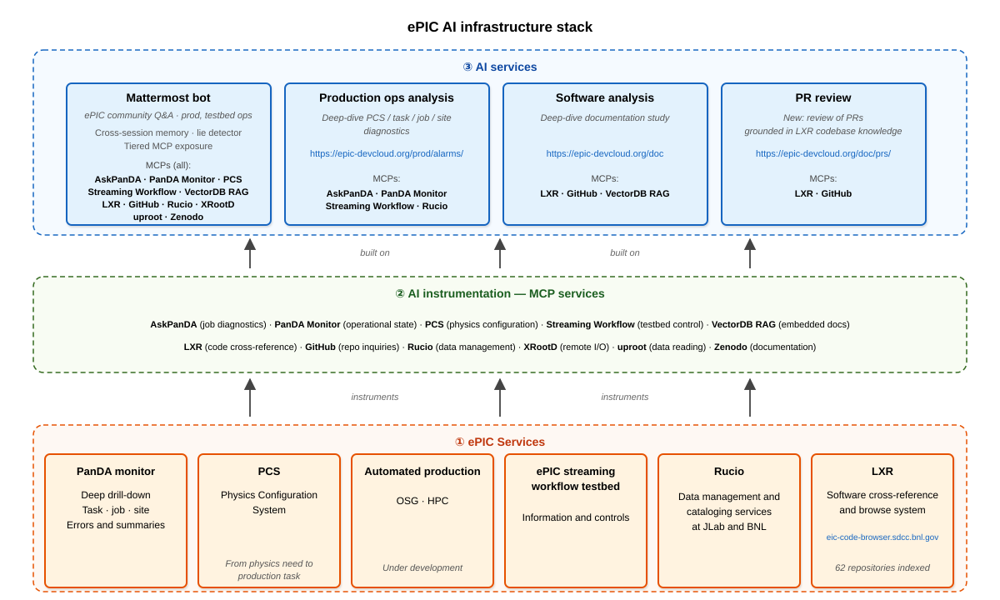](diagrams/epic_ai_stack.svg)

<!-- AI-directed description of epic_ai_stack.svg, hidden from the rendered page: the diagram content stated as text so it need not be re-inferred from the image.
This diagram depicts the three-layer ePIC AI infrastructure stack, showing how AI applications are built on MCP services that instrument the underlying ePIC services; it is the reference picture for the AI tooling architecture. Title: "ePIC AI infrastructure stack"; no subtitle. Layout: three full-width dashed horizontal layers numbered bottom-up, with upward arrows between them labeled "instruments" (layer ① to ②) and "built on" (layer ② to ③). Top blue layer "③ AI services" holds four application boxes. "Mattermost bot": italic "ePIC community Q&A · prod, testbed ops"; cross-session memory · lie detector; tiered MCP exposure; MCPs (all): AskPanDA · PanDA Monitor · PCS · Streaming Workflow · VectorDB RAG · LXR · GitHub · Rucio · XRootD · uproot · Zenodo. "Production ops analysis": italic "Deep-dive PCS / task / job / site diagnostics"; link https://epic-devcloud.org/prod/alarms/; MCPs: AskPanDA · PanDA Monitor · Streaming Workflow · Rucio. "Software analysis": italic "Deep-dive documentation study"; link https://epic-devcloud.org/doc; MCPs: LXR · GitHub · VectorDB RAG. "PR review": italic "New: review of PRs grounded in LXR codebase knowledge"; link https://epic-devcloud.org/doc/prs/; MCPs: LXR · GitHub. Middle green layer "② AI instrumentation — MCP services" lists eleven services with roles: AskPanDA (job diagnostics) · PanDA Monitor (operational state) · PCS (physics configuration) · Streaming Workflow (testbed control) · VectorDB RAG (embedded docs) · LXR (code cross-reference) · GitHub (repo inquiries) · Rucio (data management) · XRootD (remote I/O) · uproot (data reading) · Zenodo (documentation). Bottom orange layer "① ePIC Services" holds six boxes: "PanDA monitor" (deep drill-down; task · job · site; errors and summaries); "PCS" (Physics Configuration System; italic "From physics need to production task"); "Automated production" (OSG · HPC; italic "Under development"); "ePIC streaming workflow testbed" (information and controls); "Rucio" (data management and cataloging services at JLab and BNL); "LXR" (software cross-reference and browse system; link eic-code-browser.sdcc.bnl.gov; italic "62 repositories indexed"). Takeaway: a uniform MCP layer instruments the operational ePIC services and every AI application is composed from selected subsets of those MCP tools.
-->

### The MCP-Based AI Backplane

In [WFMS Platform](platform.md) — MCP spanning the machine, DAQ, Echelon 1, and global computing, with the AI
consumers riding it; DAQ and EIC Controls taps per the DAQ AI-readiness plan. Served from the
[MCP service documentation](https://github.com/BNLNPPS/swf-monitor/blob/main/docs/MCP.md)
in swf-monitor, where it evolves.

<!-- AI-directed description of mcp-ai-backplane-v1.svg, hidden from the rendered page: the diagram content stated as text so it need not be re-inferred from the image.
This diagram depicts MCP as the AI backplane connecting the ePIC domains, from the EIC machine through DAQ and global computing to code and data, down to every class of AI consumer; it is the unifying picture of AI access across the experiment. Title: "The MCP-based AI backplane — machine - DAQ - Echelon 1 - global computing"; no subtitle. Layout: a top row of four blue domain boxes, vertical purple tap lines down to a full-width purple backplane bar, and five tap lines down to a bottom row of five purple consumer boxes. Domains: "EIC collider" (the machine): accelerator controls readout; italic "monthly discussions with EIC Controls". "Echelon 0 — DAQ": slow controls readout; DAQ monitoring and logging; run log database; run control — LLM control candidate; italic "the DAQ AI-readiness plan". "Echelon 1+ — Global computing": datataking and testbed state; PCS and epicprod; PanDA workload management; Rucio catalogs — BNL and JLab; italic "deployed — O(100) tools in service". "ePIC code and data": code cross-reference (LXR); XRootD and ROOT data access; documentation and archives; italic "in service". Their taps to the backplane are labeled, respectively: "read" (dashed), "read · potential control" (dashed), "read · gated control actions" (solid), "read" (solid). The central bar reads "MCP — the AI backplane". Consumers below: "AI assistants" (interactive expert sessions: operations, development, analysis); "DISpatcher bot" (Mattermost chat interface to the full tool surface); "AI analytics" (extended LLM runs (corun-ai): analytics, assessments, reports); "AI standing agents" (credentialed operations agents, human-gated proposals); "Validation, control room AI" (data/detector evaluation, anomaly detection, ops assistance), this last on a dashed tap. Legend: "Solid connections are deployed and in use; dashed are planned or in discussion." Source note: "EIC Controls and DAQ items: the DAQ AI-readiness plan (J. Landgraf, July 2026 workfest). Echelon 1: the deployed WFMS MCP service." Takeaway: a single MCP backplane already serves global computing and code/data access to diverse AI consumers, with machine and DAQ taps and control-room AI as the planned extensions.
-->

### Notification System

In [WFMS Platform](platform.md) — the routed delivery system over the action stream: consumer-registered
subscriptions, buffered pull to external feeds, push plugins to Mattermost.

[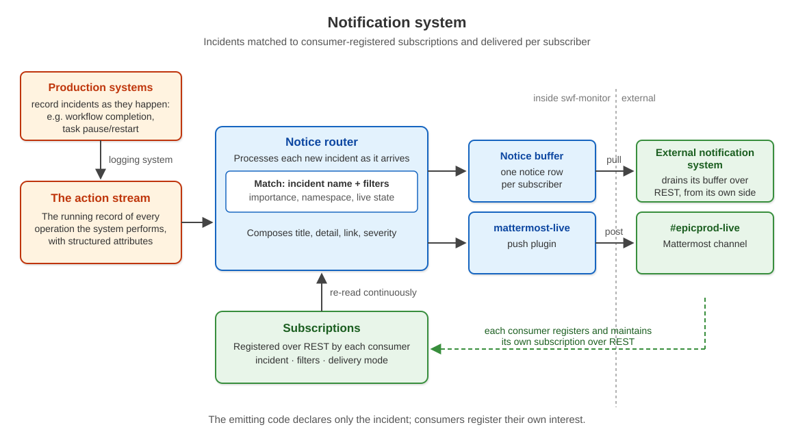](diagrams/notification_system.svg)

<!-- AI-directed description of notification_system.svg, hidden from the rendered page: the diagram content stated as text so it need not be re-inferred from the image.
This diagram depicts the notification system that routes recorded incidents to consumer-registered subscribers; it is the reference picture for notice routing. Title: "Notification system"; subtitle: "Incidents matched to consumer-registered subscriptions and delivered per subscriber". Layout: a left source column, a central router with a subscriptions box beneath it, two delivery boxes to the right, and a dashed vertical boundary labeled "inside swf-monitor | external" separating the far-right zone; a caption line at bottom. Left, orange box "Production systems" (record incidents as they happen: e.g. workflow completion, task pause/restart) arrows down into orange "The action stream" (the running record of every operation the system performs, with structured attributes), which arrows right into blue "Notice router" (one pass per cycle of the tailer service) containing a white sub-box "Match: incident name + filters" (importance, namespace, live state) and the line "Composes title, detail, link, severity". Below the router, green "Subscriptions" (registered over REST by each consumer; incident · filters · delivery mode) sends an upward arrow labeled "read every pass" into it. A green dashed elbow arrow from beneath the external zone, labeled "each consumer registers and maintains its own subscription over REST", crosses the boundary into the Subscriptions box. The router fans two arrows right: to blue "Notice buffer" (one notice row per subscriber), whose arrow labeled "pull" crosses the boundary to green "External notification system" (drains its buffer over REST, from its own side); and to blue "mattermost-live" (push plugin), whose arrow labeled "post" crosses to green "#epicprod-live" (Mattermost channel). Color semantics: orange = the producing side, blue = routing machinery, green = the consumer side. The bottom caption reads "The emitting code declares only the incident; consumers register their own interest." Takeaway: producers record incidents once and never name recipients; a router matches consumer-registered subscriptions and delivers per subscriber, by buffered pull to external feeds or in-process push to channels.
-->

### corun-ai — LLM Execution and Artifact Service

In [WFMS Platform](platform.md) — the corun-ai system: an interactive research site and the REST AI back end of the WFMS, sharing one execution machinery and artifact store.

[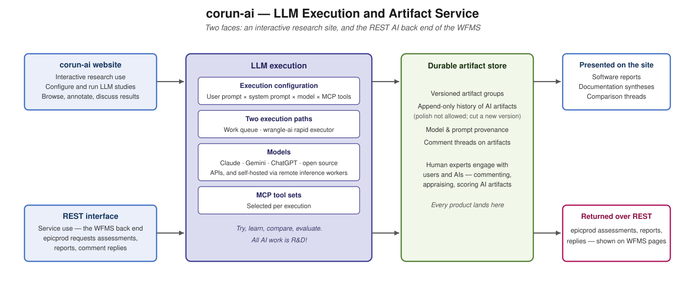](diagrams/corun_ai.svg)

<!-- AI-directed description of corun_ai.svg, hidden from the rendered page: the diagram content stated as text so it need not be re-inferred from the image.
This diagram depicts corun-ai, the LLM execution and artifact service, as a two-lane pipeline from its two client faces through shared execution and storage to its two product streams; it is the reference picture for the WFMS AI back end. Title: "corun-ai — LLM Execution and Artifact Service"; italic subtitle: "Two faces: an interactive research site, and the REST AI back end of the WFMS". Layout: four columns left to right, with a top lane (interactive) and a bottom lane (service) whose arrows pass through the two shared middle columns. Left column, top blue box "corun-ai website": interactive research use; configure and run LLM studies; browse, annotate, discuss results. Left column, bottom blue box "REST interface": service use — the WFMS back end; epicprod requests assessments, reports, comment replies. Both lanes arrow into the indigo center column "LLM execution", which contains four white sub-boxes: "Execution configuration" (user prompt × system prompt × model × MCP tools); "Two execution paths" (work queue · wrangle-ai rapid executor); "Models" (Claude · Gemini · ChatGPT · open source; APIs, and self-hosted via remote inference workers); "MCP tool sets" (selected per execution); with the italic footer "Try, learn, compare, evaluate. All AI work is R&D!". Both lanes then arrow into the green column "Durable artifact store": versioned artifact groups; append-only history of AI artifacts (polish not allowed; cut a new version); model & prompt provenance; comment threads on artifacts; human experts engage with users and AIs — commenting, appraising, scoring AI artifacts; italic "Every product lands here". Final arrows reach the right column: top box "Presented on the site" (blue border): software reports; documentation syntheses; comparison threads; bottom box "Returned over REST" (magenta border): epicprod assessments, reports, replies — shown on WFMS pages. Takeaway: the interactive research face and the WFMS service face share one execution engine and one append-only, provenance-carrying artifact store, differing only in how products are delivered.
-->

### LLM and Automated Services in epicprod

In [WFMS Platform](platform.md) — human-gated LLM assistance and credentialed automation.

[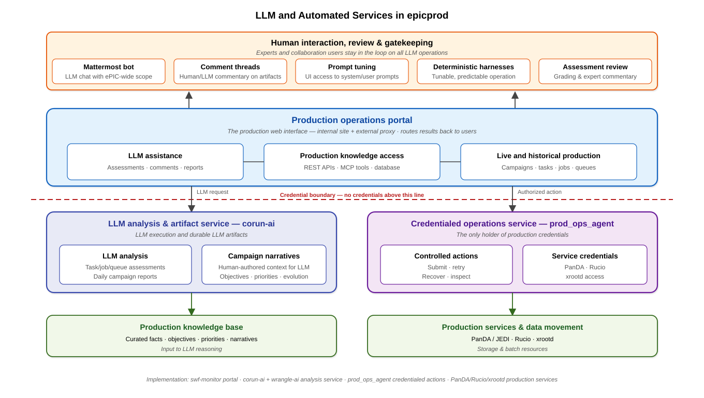](diagrams/epicprod_llm_ops_highlevel_tw.svg)

<!-- AI-directed description of epicprod_llm_ops_highlevel_tw.svg, hidden from the rendered page: the diagram content stated as text so it need not be re-inferred from the image.
This diagram depicts the high-level architecture of LLM and automated services in epicprod, emphasizing human gatekeeping above a strict credential boundary; it is the governance-oriented view of production AI operations. Title: "LLM and Automated Services in epicprod"; no subtitle. Layout: four full-width horizontal bands from top to bottom. Top orange band "Human interaction, review & gatekeeping" (italic: "Experts and collaboration users stay in the loop on all LLM operations") holds five white boxes: "Mattermost bot" (LLM chat with ePIC-wide scope); "Comment threads" (human/LLM commentary on artifacts); "Prompt tuning" (UI access to system/user prompts); "Deterministic harnesses" (tunable, predictable operation); "Assessment review" (grading & expert commentary). Two upward arrows from the band below show the portal delivering this oversight functionality. Second blue band "Production operations portal" (italic: "The production web interface — internal site + external proxy · routes results back to users") holds three linked white boxes: "LLM assistance" (assessments · comments · reports); "Production knowledge access" (REST APIs · MCP tools · database); "Live and historical production" (campaigns · tasks · jobs · queues). Below the portal runs a red dashed line labeled "Credential boundary — no credentials above this line", crossed by two downward arrows: "LLM request" on the left and "Authorized action" on the right. Third band, two services side by side: indigo "LLM analysis & artifact service — corun-ai" (italic: "LLM execution and durable LLM artifacts") with sub-boxes "LLM analysis" (task/job/queue assessments; daily campaign reports) and "Campaign narratives" (human-authored context for LLM; objectives · priorities · evolution); purple "Credentialed operations service — prod_ops_agent" (italic: "The only holder of production credentials") with sub-boxes "Controlled actions" (submit · retry; recover · inspect) and "Service credentials" (PanDA · Rucio; xrootd access). Green downward arrows lead to two green stores: "Production knowledge base" (curated facts · objectives · priorities · narratives; italic "Input to LLM reasoning") and "Production services & data movement" (PanDA / JEDI · Rucio · xrootd; italic "Storage & batch resources"). An italic footnote reads: "Implementation: swf-monitor portal · corun-ai + wrangle-ai analysis service · prod_ops_agent credentialed actions · PanDA/Rucio/xrootd production services". Takeaway: LLM analysis and credentialed action are split into separate services below a hard credential boundary, with all LLM operations surfaced through the portal for human review and gatekeeping.
-->

### E0-E1 Workflow Schematic

In [Streaming Workflows](streaming.md) — the E0-E1 interface: DAQ exit buffer, STF and TF streams to the E1 facilities, and the streaming workflow testbed scope.

[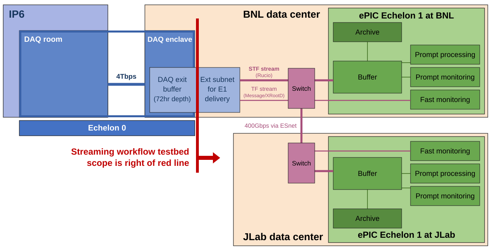](diagrams/E0-E1_workflow_schematic.svg)

<!-- AI-directed description of E0-E1_workflow_schematic.svg, hidden from the rendered page: the diagram content stated as text so it need not be re-inferred from the image.
Facility-level schematic of the ePIC Echelon 0 to Echelon 1 streaming architecture, delineating what the streaming workflow testbed covers. There is no title text; labels identify regions. Three facility blocks: a blue-violet IP6 box (left), an orange BNL data center box (top), and an orange JLab data center box (bottom right). Inside IP6 sits a blue DAQ room box; inside BNL sits a blue DAQ enclave box; a thick blue line labeled 4Tbps joins them, and a thick blue border encloses both as one DAQ system. Spanning the enclave's edge is the DAQ exit buffer (72hr depth) with an "Ext subnet for E1 delivery" face. A dark blue bar labeled Echelon 0 spans exactly the DAQ system width below it. Green "ePIC Echelon 1 at BNL" box holds Archive, Buffer, Prompt processing, Prompt monitoring, and Fast monitoring sub-boxes; "ePIC Echelon 1 at JLab" mirrors it (Fast monitoring, Prompt processing, Prompt monitoring, Buffer, Archive). Magenta streams flow from the exit buffer through a pink Switch box at BNL: a thick "STF stream (Rucio)" line into the BNL E1 Buffer, and a thinner "TF stream (Message/XRootD)" line into Fast monitoring. A thick vertical magenta line labeled "400Gbps via ESnet" connects the BNL switch to a JLab Switch box, which feeds the JLab Fast monitoring (thin) and Buffer (thick). A heavy red vertical line with a red arrow states "Streaming workflow testbed scope is right of red line", cutting just outside the DAQ exit buffer. Takeaway: the testbed's scope begins at the DAQ exit buffer and covers STF and TF delivery into the two mirrored Echelon 1 sites.
-->

### The Streaming Workflow Testbed

In [Streaming Workflows](streaming.md) — the first two testbed workflows on the common WFMS platform: prompt processing of STF files on arrival, and fast TF streaming processing on persistent PanDA-managed workers, with the decision box, AI assessment agents, and swf-monitor alongside.

[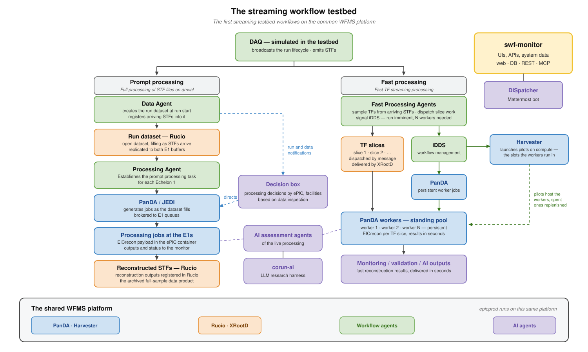](diagrams/testbed_workflows.svg)

<!-- AI-directed description of testbed_workflows.svg, hidden from the rendered page: the diagram content stated as text so it need not be re-inferred from the image.
Overview of the two first streaming testbed workflows and their shared platform. Title: "The streaming workflow testbed"; subtitle: "The first streaming testbed workflows on the common WFMS platform". A top agent-green box, "DAQ — simulated in the testbed" (broadcasts the run lifecycle · emits STFs), splits via orthogonal arrows into two columns. Left column, headed "Prompt processing" (Full processing of STF files on arrival), is a vertical chain: Data Agent (creates the run dataset at run start; registers arriving STFs into it) → Run dataset — Rucio (open dataset, filling as STFs arrive; replicated to both E1 buffers) → Processing Agent (establishes the prompt processing task for each Echelon 1) → PanDA / JEDI (generates jobs as the dataset fills; brokered to E1 queues) → Processing jobs at the E1s (EICrecon payload in the ePIC container; outputs and status to the monitor) → Reconstructed STFs — Rucio (reconstruction outputs registered in Rucio; the archived full-sample data product). Between columns a purple Decision box (processing decisions by ePIC, facilities, based on data inspection) receives dashed blue "run and data notifications" from the left chain and "directs" back into it. Right column, headed "Fast processing" (Fast TF streaming processing): Fast Processing Agents (sample TFs from arriving STFs · dispatch slice work; signal iDDS — run imminent, N workers needed) feed TF slices (slice 1 · slice 2 · …; dispatched by message, delivered by XRootD) and iDDS (workflow management); iDDS → Harvester (launches pilots on compute — the slots the workers run in) and → PanDA (persistent worker jobs); slices and PanDA converge on "PanDA workers — standing pool" (worker 1 · worker 2 · worker N — persistent; EICrecon per TF slice, results in seconds) → "Monitoring / validation / AI outputs" (fast reconstruction results, delivered in seconds). A dashed green Harvester arrow notes "pilots host the workers, spent ones replenished". Mid-diagram purple "AI assessment agents" (of the live processing) links by dashed lines to both columns and down to corun-ai (LLM research harness). Top right floats yellow swf-monitor (UIs, APIs, system data; web · DB · REST · MCP) with DISpatcher (Mattermost bot) beneath. A bottom band, "The shared WFMS platform" ("epicprod runs on this same platform"), carries chips PanDA · Harvester (blue), Rucio · XRootD (orange), Workflow agents (green), AI agents (purple), which is also the color legend for the whole diagram. Takeaway: prompt full-sample processing and fast TF-slice processing are two workflows driven from one simulated DAQ on one shared WFMS platform.
-->

### Time Frames and Super Time Frames

In [Streaming Workflows](streaming.md) — the contiguous TF stream with its file markers, time order within an STF
against any-order processing among STFs, and the sampling and direct-stream paths.

[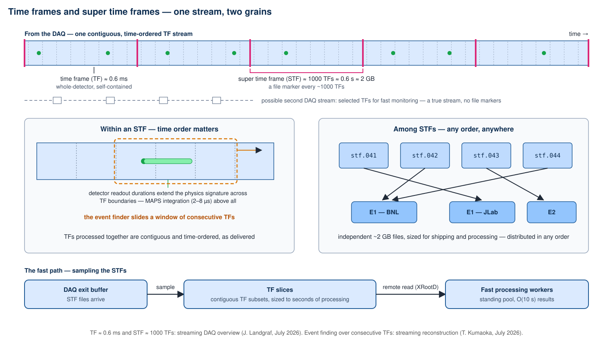](diagrams/tf_stf_explainer.svg)

<!-- AI-directed description of tf_stf_explainer.svg, hidden from the rendered page: the diagram content stated as text so it need not be re-inferred from the image.
Explainer of ePIC time frames and super time frames and the processing grains they imply. Title: "Time frames and super time frames". Tier 1, "From the DAQ — one contiguous, time-ordered TF stream" (with "time →" at right): a long blue band divided into TF cells, green dots marking TFs holding physics events, and pink vertical file markers. Callouts: "time frame (TF) ≈ 0.6 ms; whole-detector, self-contained"; "super time frame (STF) ≈ 1000 TFs ≈ 0.6 s ≈ 2 GB; a file marker every ~1000 TFs"; a green note: "green: physics — at top rates ~300 events in a TF amid ~2×10⁶ background". Tier 2 has two panels. Left, "Within an STF — time order matters": a TF band with a green event dot on a TF boundary; "detector readout durations stretch the physics signature across TF boundaries — MAPS integration (2–8 µs) above all"; a dashed orange window with a right arrow: "the event finder slides a window of consecutive TFs, scanning in fine (~20 ns) time slices"; "TFs processed together are contiguous and time-ordered, as delivered". Right, "Among STFs — any order, anywhere": files stf.041 through stf.044 with crossing arrows to E1 — BNL, E1 — JLab, and E2; "independent ~2 GB files, sized for shipping, processing, archiving — processed in any order". Tier 3, "From the DAQ and its exit buffer — STF processing, sample processing, fast monitoring": DAQ exit buffer (STF files arrive) → STF stream → E1 buffers — BNL and JLab (run datasets fill as STFs arrive) → Prompt STF processing (complete first-pass results, minutes to hours); the E1 buffers also emit a "sample" arrow to TF sampling from STFs (to consumers via messaging and XRootD) → remote read (XRootD) → Fast processing workers (standing pool, O(10 s) results); separately DAQ TF substream → TF stream → Direct TF stream consumers (results within seconds). Takeaway: time order matters inside an STF but STFs are independent files, giving three processing paths with latencies from minutes to seconds.
-->

### Prompt Processing Workflow

In [Streaming Workflows](streaming.md) — full-sample processing of STFs as they arrive, from run signals through the filling run dataset to PanDA jobs at the E1s and Rucio-registered reconstructed outputs, with the conceptual decision box.

[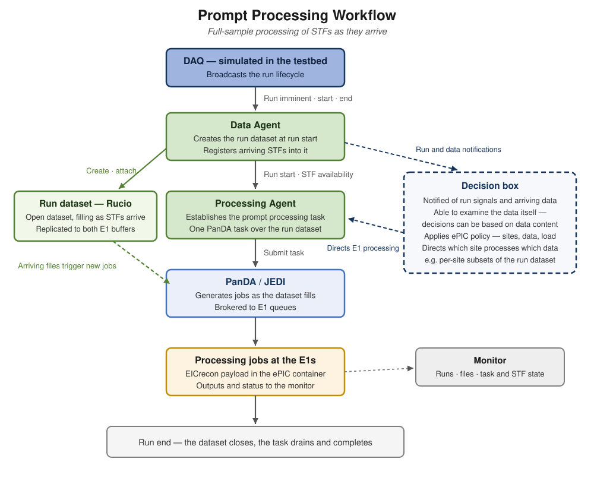](diagrams/prompt_processing_workflow.svg)

<!-- AI-directed description of prompt_processing_workflow.svg, hidden from the rendered page: the diagram content stated as text so it need not be re-inferred from the image.
Sequence diagram of the testbed prompt processing workflow from DAQ signals to archived outputs. Title: "Prompt Processing Workflow"; subtitle: "Full-sample processing of STFs as they arrive". A central vertical chain: "DAQ — simulated in the testbed" (Broadcasts the run lifecycle) → arrow labeled "Run imminent · start · end" → Data Agent (Creates the run dataset at run start; Registers arriving STFs into it). A green arrow labeled "Create · attach" goes left to "Run dataset — Rucio" (Open dataset, filling as STFs arrive; Replicated to both E1 buffers). Data Agent → arrow "Run start · STF availability" → Processing Agent (Establishes the prompt processing task; One PanDA task over the run dataset) → arrow "Submit task" → PanDA / JEDI (Generates jobs as the dataset fills; Brokered to E1 queues). A dashed green arrow from the Rucio dataset into PanDA reads "Arriving files trigger new jobs". PanDA → Processing jobs at the E1s (EICrecon payload in the ePIC container; Outputs and status to the monitor), which sends an arrow left into "Reconstructed STFs — Rucio" (Reconstruction outputs registered in Rucio — the full-sample product) and continues down to a gray band: "Run end — the dataset closes, the task drains and completes". On the right a dashed navy "Decision box": Notified of run signals and arriving data; Able to examine the data itself — decisions can be based on data content; Applies ePIC policy — sites, data, load; Directs which site processes which data; e.g. per-site subsets of the run dataset. Dashed navy arrows carry "Run and data notifications" into it and "Directs E1 processing" back toward PanDA. Bottom right, a Monitor box (Runs · files · task and STF state) receives a dashed gray arrow from the E1 jobs. Takeaway: agents turn DAQ run signals into a filling Rucio dataset and a single incrementally-executing PanDA task, with a policy decision box steering site placement.
-->

### Fast Processing Pipeline

In [Streaming Workflows](streaming.md) — the testbed fast-processing pipeline from simulated DAQ through TF slices to the standing worker pool.

[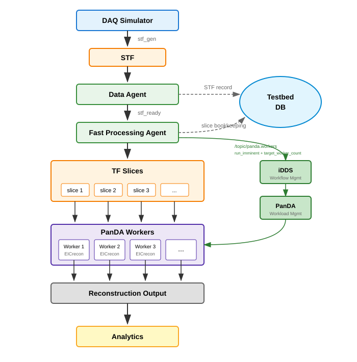](diagrams/fast-processing-pipeline-v11.svg)

<!-- AI-directed description of fast-processing-pipeline-v11.svg, hidden from the rendered page: the diagram content stated as text so it need not be re-inferred from the image.
Pipeline diagram of the fast processing dataflow from simulated DAQ to analytics, with its control side-channel. No title text. The main vertical pipeline: DAQ Simulator → arrow labeled stf_gen → STF → Data Agent → arrow labeled stf_ready → Fast Processing Agent → TF Slices box containing chips slice 1, slice 2, slice 3, … → parallel arrows into the PanDA Workers box containing Worker 1, Worker 2, Worker 3 (each annotated EICrecon) and an ellipsis → parallel arrows to Reconstruction Output → Analytics. The arrow labels are the ActiveMQ message types passing between stages; the Fast Processing Agent makes TF slices directly from arriving STFs on stf_ready. On the upper right an ellipse labeled Testbed DB receives dashed bookkeeping arrows: "STF record" from the Data Agent and "slice bookkeeping" from the Fast Processing Agent. On the lower right a green control arc runs from the Fast Processing Agent to iDDS (Workflow Mgmt), annotated "/topic/panda.workers" and "run_imminent + target_worker_count", then down to PanDA (Workload Mgmt), then back into the PanDA Workers box. Color semantics: blue = DAQ simulator, orange = data objects (STF, slices), green = agents and iDDS/PanDA control, deep purple = workers, gray = output, yellow = analytics. Takeaway: data flows down a message-driven agent pipeline into a standing EICrecon worker pool, while a separate iDDS/PanDA control path provisions and sizes that pool ahead of the run.
-->

### iDDS/PanDA/Harvester Detail

In [Streaming Workflows](streaming.md) — worker provisioning behind the fast-processing pool.

[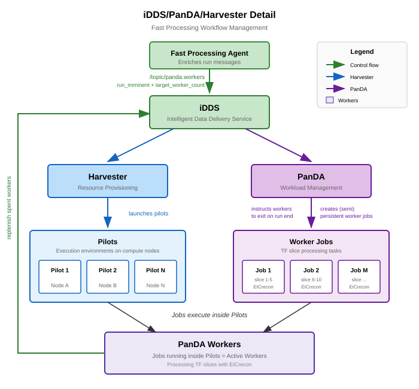](diagrams/idds-panda-detail-v1.svg)

<!-- AI-directed description of idds-panda-detail-v1.svg, hidden from the rendered page: the diagram content stated as text so it need not be re-inferred from the image.
Detail view of how iDDS, PanDA, and Harvester cooperate to provide the fast processing worker pool. Title: "iDDS/PanDA/Harvester Detail"; subtitle: "Fast Processing Workflow Management". Top: Fast Processing Agent (Enriches run messages) sends a green control arrow annotated "/topic/panda.workers" and "run_imminent + target_worker_count" to iDDS (Intelligent Data Delivery Service), the central workflow manager. iDDS branches two ways. Left blue branch: Harvester (Resource Provisioning), which "launches pilots" into a Pilots container (Execution environments on compute nodes) holding Pilot 1 on Node A, Pilot 2 on Node B, Pilot N on Node N. Right purple branch: PanDA (Workload Management), annotated "creates (semi) persistent worker jobs" and "instructs workers to exit on run end", feeding a Worker Jobs container (TF slice processing tasks) holding Job 1 (slice 1-5, EICrecon), Job 2 (slice 6-10, EICrecon), Job M (slice …, EICrecon). An italic annotation between them states "Jobs execute inside Pilots". Both containers arrow down into a PanDA Workers box (Jobs running inside Pilots = Active Workers; Processing TF slices with EICrecon). A green feedback path runs from the workers along the left edge back up into iDDS, labeled vertically "replenish spent workers". A legend maps green arrows to Control flow, blue to Harvester, purple to PanDA, and the lavender box fill to Workers. Takeaway: an active fast-processing worker equals a PanDA job running inside a Harvester pilot, with iDDS closing the loop by replenishing spent workers to hold the pool at target size.
-->

### Testbed Agent Management

In [Streaming Workflows](streaming.md) — how testbed agents are configured, launched, and supervised: CLI and MCP control, the per-user agent manager, and supervisord.

[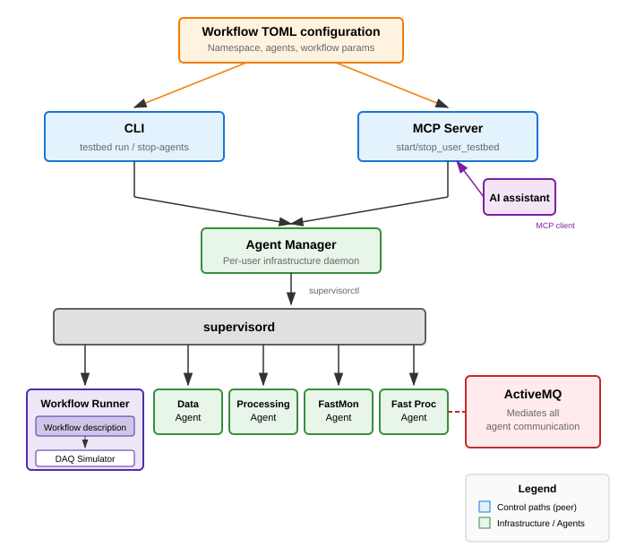](diagrams/testbed_agent_management.svg)

<!-- AI-directed description of testbed_agent_management.svg, hidden from the rendered page: the diagram content stated as text so it need not be re-inferred from the image.
Component diagram of how testbed agents are configured, started, and supervised per user. No title text. Top center: "Workflow TOML configuration" (Namespace, agents, workflow params) with orange arrows to two peer control mechanisms: CLI (testbed run / stop-agents) on the left and MCP Server (start/stop_user_testbed) on the right; a small purple "AI assistant" box connects to the MCP Server with the annotation "MCP client". Both control paths converge on the Agent Manager (Per-user infrastructure daemon), which drives supervisord via an arrow labeled supervisorctl. The wide gray supervisord bar fans out straight down to five agent boxes: Workflow Runner (shown with inner structure: a "Workflow description" chip feeding a "DAQ Simulator" chip), Data Agent, Processing Agent, FastMon Agent, and Fast Proc Agent. To the right, a red-bordered ActiveMQ box (Mediates all agent communication) connects to the agent row with a dashed red line. A legend states: blue = Control paths (peer); green = Infrastructure / Agents. Takeaway: CLI and MCP are equal front doors over a per-user Agent Manager that runs all workflow agents under supervisord, with ActiveMQ as the message fabric between them.
-->

### Testbed Multi-User Isolation

In [Streaming Workflows](streaming.md) — shared infrastructure with independent per-user operation: namespaces, per-user agent identity, and filtered views.

[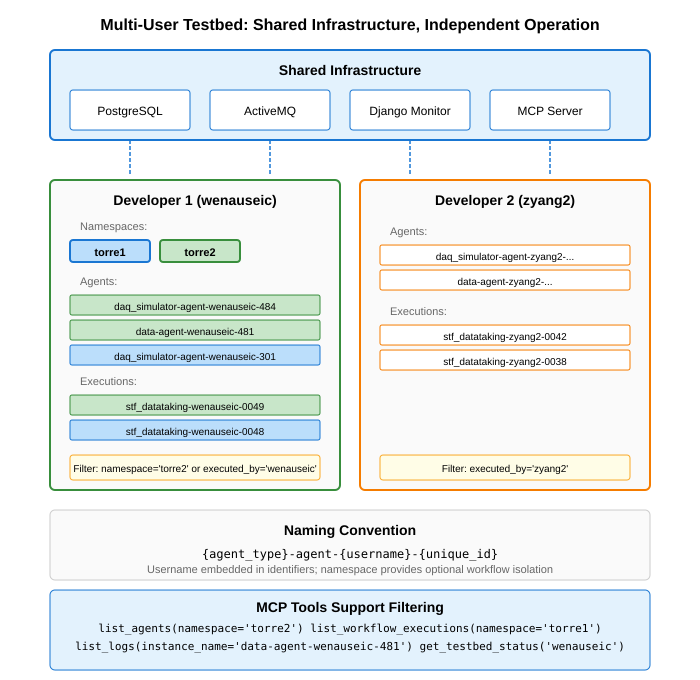](diagrams/testbed_multi_user.svg)

<!-- AI-directed description of testbed_multi_user.svg, hidden from the rendered page: the diagram content stated as text so it need not be re-inferred from the image.
Diagram of how multiple developers share one testbed while operating independently. Title: "Multi-User Testbed: Shared Infrastructure, Independent Operation". A top blue band, "Shared Infrastructure", holds four boxes: PostgreSQL, ActiveMQ, Django Monitor, MCP Server, with dashed lines down to two user spaces. Left space "Developer 1 (wenauseic)": a Namespaces row with chips torre1 (blue) and torre2 (green); an Agents list color-coded by namespace: daq_simulator-agent-wenauseic-484 (green), data-agent-wenauseic-481 (green), daq_simulator-agent-wenauseic-301 (blue); an Executions list: stf_datataking-wenauseic-0049 (green), stf_datataking-wenauseic-0048 (blue); and a yellow filter note: Filter: namespace='torre2' or executed_by='wenauseic'. Right space "Developer 2 (zyang2)": Agents daq_simulator-agent-zyang2-… and data-agent-zyang2-…; Executions stf_datataking-zyang2-0042 and stf_datataking-zyang2-0038; yellow filter note: Filter: executed_by='zyang2'. A bottom "Naming Convention" box gives the monospace pattern {agent_type}-agent-{username}-{unique_id} and the note "Username embedded in identifiers; namespace provides optional workflow isolation". A final blue box, "MCP Tools Support Filtering", lists example calls: list_agents(namespace='torre2'), list_workflow_executions(namespace='torre1'), list_logs(instance_name='data-agent-wenauseic-481'), get_testbed_status('wenauseic'). Color semantics: blue fill = namespace torre1, green fill = namespace torre2, orange outline = the second developer's items. Takeaway: usernames baked into identifiers plus optional namespaces let many users run concurrently on shared services, with MCP filters slicing views per user or namespace.
-->

### The E0-E1 Global State

In [Streaming Workflows](streaming.md) — the global state across a datataking arc: core state and readiness over time,
with detector participation, slow controls, and data flows as concurrent lanes. Served from the
[state machine document](https://github.com/BNLNPPS/swf-testbed/blob/main/docs/e0-e1-state-machine.md)
in swf-testbed, where it evolves.

<!-- AI-directed description of e0-e1-global-state-v1.svg, hidden from the rendered page: the diagram content stated as text so it need not be re-inferred from the image.
Timeline diagram of the ePIC E0-E1 global state model across one datataking arc, read as horizontal lanes against shared state boundaries. Title: "The ePIC E0-E1 global state across a datataking arc". Dashed vertical lines mark state transitions common to all lanes. Core state lane (monospace labels, blue shading deepening with activity): off → no_beam → beam → run (the widest, darkest segment) → beam → no_beam → off. Readiness lane: not_ready → ready → physics → standby (yellow) → physics → not_ready; green segments mark ready/physics, yellow the mid-run standby dip. Detector participation lanes: detector A shown "in the run" for the full run span; detector B "in the run" with a shorter bar and the note "drops out mid-run"; detector C drawn as a dashed outline, "out of the run — reduced participation". Slow controls lane: good (green) → degraded (yellow) → good, with the degraded stretch overlapping the standby dip. Data flavors lanes: lumi runs "while the collider operates", spanning beam and run; a second bar labeled eic epic daq calib spans nearly the whole arc, annotated "in and out of datataking — machine, detector, DAQ and calibration flows cross the run boundaries". Steady state components lane: a bar annotated "e.g. scalers — carrying their own state across run boundaries". A red vertical line cuts all lanes, labeled "the global state at an instant", and a bottom caption reads: "A vertical cut through the lanes is the global state: core state and readiness, detector participation, slow-controls status, and the active flows." Takeaway: global state is not a single run flag but the simultaneous vertical cut across core state, readiness, per-detector participation, slow controls, and active data flows, several of which cross run boundaries.
-->

### epicprod — the ePIC Production System

In [Production System](production.md) — the production workflow stages, LLM services, and credentialed operations of epicprod.

[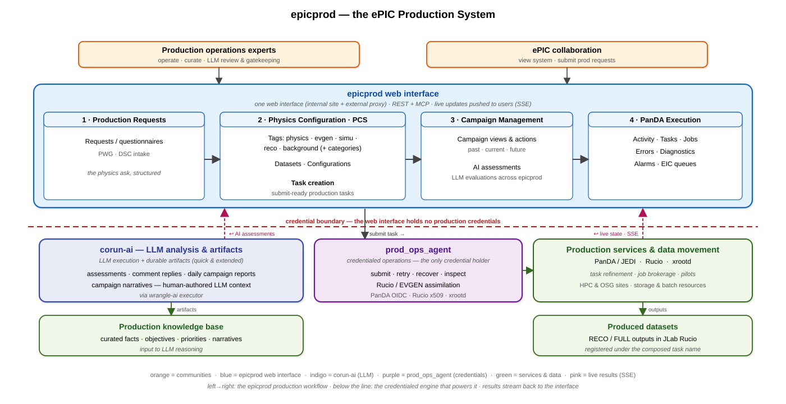](diagrams/epicprod_system.svg)

<!-- AI-directed description of epicprod_system.svg, hidden from the rendered page: the diagram content stated as text so it need not be re-inferred from the image.
Top-level architecture of epicprod, the ePIC production system, split by a credential boundary. Title: "epicprod — the ePIC Production System". Two orange community boxes at top: "Production operations experts" (operate · curate · LLM review & gatekeeping) and "ePIC collaboration" (view system · submit prod requests), both arrowing into a wide blue band, "epicprod web interface" ("one web interface (internal site + external proxy) · REST + MCP · live updates pushed to users (SSE)"). Inside, four stages flow left to right with arrows: 1 · Production Requests (Requests / questionnaires; PWG · DSC intake; "the physics ask, structured"); 2 · Physics Configuration · PCS (Tags: physics · evgen · simu · reco · background (+ categories); Datasets · Configurations; Task creation, submit-ready production tasks); 3 · Campaign Management (Campaign views & actions, past · current · future; AI assessments, LLM evaluations across epicprod); 4 · PanDA Execution (Activity · Tasks · Jobs; Errors · Diagnostics; Alarms · EIC queues). A dashed red rule below reads "credential boundary — the web interface holds no production credentials"; crossing it are a solid down arrow "submit task", and dashed pink up arrows "AI assessments" and "live state · SSE". Below the boundary, three engine boxes: indigo "corun-ai — LLM analysis & artifacts" (LLM execution + durable artifacts (quick & extended); assessments · comment replies · daily campaign reports; campaign narratives — human-authored LLM context; via wrangle-ai executor); purple "prod_ops_agent" (credentialed operations — the only credential holder; submit · retry · recover · inspect; Rucio / EVGEN assimilation; PanDA OIDC · Rucio x509 · xrootd), with a green arrow into green "Production services & data movement" (PanDA / JEDI · Rucio · xrootd; task refinement · job brokerage · pilots; HPC & OSG sites · storage & batch resources). Two green stores at bottom: "Production knowledge base" (curated facts · objectives · priorities · narratives; input to LLM reasoning), fed by an "artifacts" arrow from corun-ai, and "Produced datasets" (RECO / FULL outputs in JLab Rucio; registered under the composed task name), fed by an "outputs" arrow. Legend: orange = communities · blue = epicprod web interface · indigo = corun-ai (LLM) · purple = prod_ops_agent (credentials) · green = services & data · pink = live results (SSE); and "left→right: the epicprod production workflow · below the line: the credentialed engine that powers it · results stream back to the interface". Takeaway: a credential-free web workflow above the line is powered by a credentialed engine below it, with results streamed back live.
-->

### End to End Production Automation

In [Production System](production.md) — the automation stage by stage, request intake to the next campaign, with the human control points.

[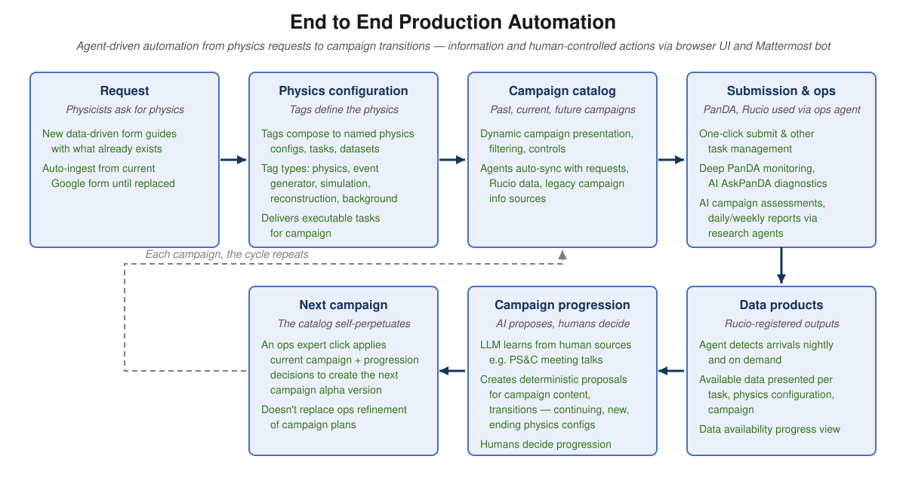](diagrams/epicprod_automation_flow.svg)

<!-- AI-directed description of epicprod_automation_flow.svg, hidden from the rendered page: the diagram content stated as text so it need not be re-inferred from the image.
Cyclic flow of end-to-end production automation across a campaign's life. Title: "End to End Production Automation"; subtitle: "Agent-driven automation from physics requests to campaign transitions — information and human-controlled actions via browser UI and Mattermost bot". Seven blue boxes form a loop over two rows; in each, an italic gray line states the role and green lines list capabilities. Row 1, left to right with navy arrows: Request (Physicists ask for physics; New data-driven form guides with what already exists; Auto-ingest from current Google form until replaced) → Physics configuration (Tags define the physics; Tags compose to named physics configs, tasks, datasets; Tag types: physics, event generator, simulation, reconstruction, background; Delivers executable tasks for campaign) → Campaign catalog (Past, current, future campaigns; Dynamic campaign presentation, filtering, controls; Agents auto-sync with requests, Rucio data, legacy campaign info sources) → Submission & ops (PanDA, Rucio used via ops agent; One-click submit & other task management; Deep PanDA monitoring, AI AskPanDA diagnostics; AI campaign assessments, daily/weekly reports via research agents). The flow wraps down and runs row 2 right to left: Data products (Rucio-registered outputs; Agent detects arrivals nightly and on demand; Available data presented per task, physics configuration, campaign; Data availability progress view) → Campaign progression (AI proposes, humans decide; LLM learns from human sources e.g. PS&C meeting talks; Creates deterministic proposals for campaign content, transitions — continuing, new, ending physics configs; Humans decide progression) → Next campaign (The catalog self-perpetuates; An ops expert click applies current campaign + progression decisions to create the next campaign alpha version; Doesn't replace ops refinement of campaign plans). A dashed gray polyline loops from Next campaign back up into Campaign catalog, captioned "Each campaign, the cycle repeats". Takeaway: agents automate the request-to-data pipeline while humans decide campaign progression, and each cycle seeds the next campaign from the last.
-->

### ePIC Automated Production Workflow

In [Production System](production.md) — the production workflow and the task catalog staged by campaign lifecycle.

[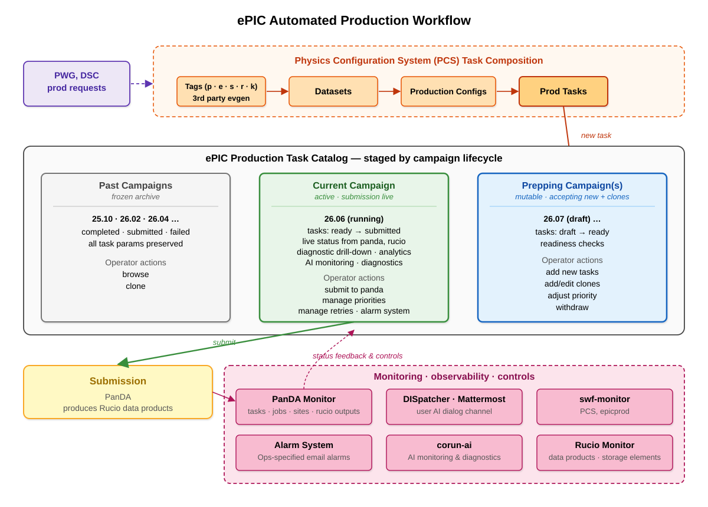](diagrams/epicprod_task_catalog.svg)

<!-- AI-directed description of epicprod_task_catalog.svg, hidden from the rendered page: the diagram content stated as text so it need not be re-inferred from the image.
Diagram of the campaign-lifecycle task catalog at the center of the automated production workflow. Title: "ePIC Automated Production Workflow". Upstream, a purple "PWG, DSC prod requests" box feeds by dashed arrow into a dashed orange band, "Physics Configuration System (PCS) Task Composition", whose internal chain is Tags (p · e · s · r · k) / 3rd party evgen → Datasets → Production Configs → Prod Tasks; from Prod Tasks a "new task" arrow drops into the catalog's right column. The central gray container, "ePIC Production Task Catalog — staged by campaign lifecycle", holds three columns. Past Campaigns (gray, "frozen archive"): 25.10 · 26.02 · 26.04 …; completed · submitted · failed; all task params preserved; Operator actions: browse, clone. Current Campaign (green, "active · submission live"): 26.06 (running); tasks: ready → submitted; live status from panda, rucio; diagnostic drill-down · analytics; AI monitoring · diagnostics; Operator actions: submit to panda, manage priorities, manage retries · alarm system. Prepping Campaign(s) (blue, "mutable · accepting new + clones"): 26.07 (draft) …; tasks: draft → ready; readiness checks; Operator actions: add new tasks, add/edit clones, adjust priority, withdraw. A green "submit" arrow runs from Current to a yellow Submission box (PanDA; produces Rucio data products). A dashed pink container, "Monitoring · observability · controls", holds six boxes: PanDA Monitor (tasks · jobs · sites · rucio outputs), DISpatcher · Mattermost (user AI dialog channel), swf-monitor (PCS, epicprod), Alarm System (Ops-specified email alarms), corun-ai (AI monitoring & diagnostics), Rucio Monitor (data products · storage elements). A pink arrow links Submission into monitoring, and a dashed pink curve returns "status feedback & controls" to the Current column. Takeaway: PCS composes tasks into a catalog staged as prepping, current, and past campaigns, with submission to PanDA and a monitoring ring feeding status and controls back to the live campaign.
-->

### ePIC Production Dataflow

In [Production System](production.md) — job orchestration and the payload-handled science data path against JLab Rucio.

[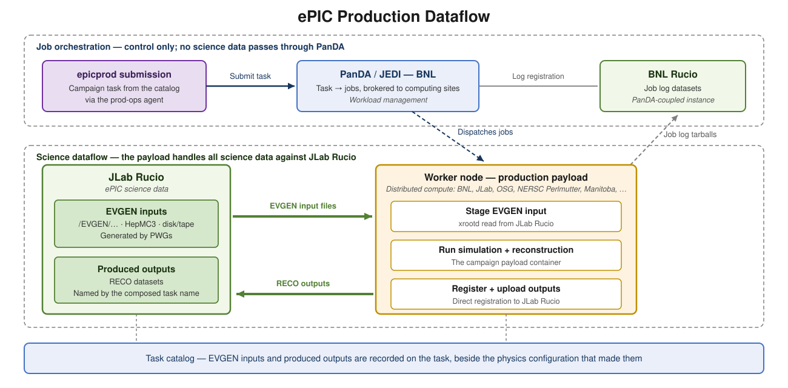](diagrams/epicprod_dataflow.svg)

<!-- AI-directed description of epicprod_dataflow.svg, hidden from the rendered page: the diagram content stated as text so it need not be re-inferred from the image.
Dataflow diagram separating production job orchestration from science data movement. Title: "ePIC Production Dataflow". Two dashed zones. Top zone, "Job orchestration — control only; no science data passes through PanDA": purple "epicprod submission" (Campaign task from the catalog via the prod-ops agent) → arrow "Submit task" → blue "PanDA / JEDI — BNL" (Task → jobs, brokered to computing sites; Workload management) → a line labeled "Log registration" → green "BNL Rucio" (Job log datasets; PanDA-coupled instance). Two dashed connectors cross between zones: "Dispatches jobs" from PanDA down to the worker node, and "Job log tarballs" from the worker node up to BNL Rucio. Bottom zone, "Science dataflow — the payload handles all science data against JLab Rucio": on the left a large green "JLab Rucio" box (ePIC science data) containing "EVGEN inputs" (/EVGEN/… · HepMC3 · disk/tape; Generated by PWGs) and "Produced outputs" (RECO datasets; Named by the composed task name); on the right a tan "Worker node — production payload" box (Distributed compute: BNL, JLab, OSG, NERSC Perlmutter, Manitoba, …) with three internal steps: Stage EVGEN input (xrootd read from JLab Rucio), Run simulation + reconstruction (The campaign payload container), Register + upload outputs (Direct registration to JLab Rucio). Thick green arrows carry "EVGEN input files" from JLab Rucio to the worker and "RECO outputs" back. Dashed lineage lines drop from both boxes into a bottom blue band: "Task catalog — EVGEN inputs and produced outputs are recorded on the task, beside the physics configuration that made them". Takeaway: PanDA moves only control and logs while the payload itself stages inputs from and registers outputs to JLab Rucio, with full lineage recorded on the catalog task.
-->

### LLM and Distributed Computing Services Integration — Detailed Architecture

In [Production System](production.md) — the detailed LLM operations architecture: SSE relay, LLM executors, credentialed agent, and artifact store.

[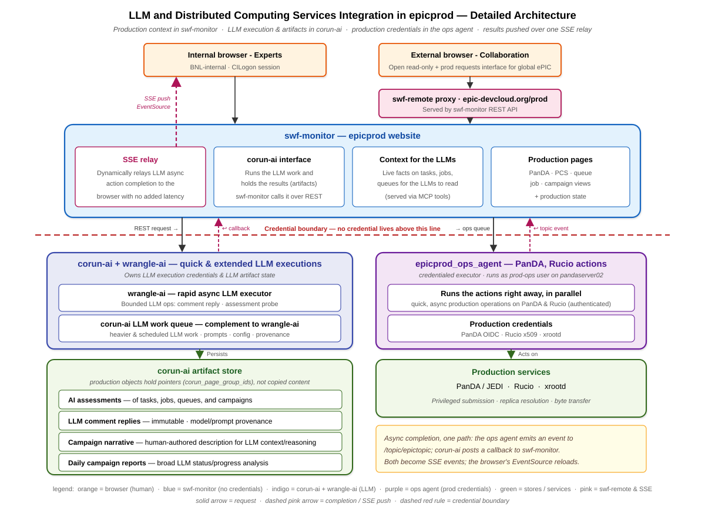](diagrams/epicprod_llm_ops_architecture.svg)

<!-- AI-directed description of epicprod_llm_ops_architecture.svg, hidden from the rendered page: the diagram content stated as text so it need not be re-inferred from the image.
Detailed architecture of LLM and distributed-computing service integration in epicprod. Title: "LLM and Distributed Computing Services Integration in epicprod — Detailed Architecture"; subtitle: "Production context in swf-monitor · LLM execution & artifacts in corun-ai · production credentials in the ops agent · results pushed over one SSE relay". Top row: orange "Internal browser - Experts" (BNL-internal · CILogon session) and "External browser - Collaboration" (Open read-only + prod requests interface for global ePIC); the external browser passes through a pink "swf-remote proxy · epic-devcloud.org/prod" (Served by swf-monitor REST API). Both reach the blue hub "swf-monitor — epicprod website", which contains four cells: SSE relay (Dynamically relays LLM async action completion to the browser with no added latency); corun-ai interface (Runs the LLM work and holds the results (artifacts); swf-monitor calls it over REST); Context for the LLMs (Live facts on tasks, jobs, queues for the LLMs to read, served via MCP tools); Production pages (PanDA · PCS · queue, job · campaign views + production state). A dashed pink SSE push arrow (EventSource) runs from the SSE relay straight up to the internal browser. A dashed red rule states "Credential boundary — no credential lives above this line"; crossing it are solid down arrows "REST request" and "ops queue" paired with dashed pink up arrows "callback" and "topic event". Below left, indigo "corun-ai + wrangle-ai — quick & extended LLM executions" (Owns LLM execution credentials & LLM artifact state) holds "wrangle-ai — rapid async LLM executor" (Bounded LLM ops: comment reply · assessment probe) and "corun-ai LLM work queue — complement to wrangle-ai" (heavier & scheduled LLM work · prompts · config · provenance); a green "Persists" arrow drops to the green "corun-ai artifact store" (production objects hold pointers (corun_page_group_ids), not copied content) listing AI assessments — of tasks, jobs, queues, and campaigns; LLM comment replies — immutable · model/prompt provenance; Campaign narrative — human-authored description for LLM context/reasoning; Daily campaign reports — broad LLM status/progress analysis. Below right, purple "epicprod_ops_agent — PanDA, Rucio actions" (credentialed executor · runs as prod-ops user on pandaserver02) holds "Runs the actions right away, in parallel" (quick, async production operations on PanDA & Rucio, authenticated) and "Production credentials" (PanDA OIDC · Rucio x509 · xrootd); a green "Acts on" arrow drops to green "Production services" (PanDA / JEDI · Rucio · xrootd; Privileged submission · replica resolution · byte transfer). A yellow note explains async completion: the ops agent emits an event to /topic/epictopic; corun-ai posts a callback to swf-monitor; both become SSE events and the browser's EventSource reloads. Legend: orange = browser (human) · blue = swf-monitor (no credentials) · indigo = corun-ai + wrangle-ai (LLM) · purple = ops agent (prod credentials) · green = stores / services · pink = swf-remote & SSE; solid arrow = request · dashed pink arrow = completion / SSE push · dashed red rule = credential boundary. Takeaway: swf-monitor holds no credentials and merely orchestrates; LLM execution and production actions live in dedicated credentialed services whose async completions all return to the browser through one SSE relay.
-->

### The Physics Configuration System

In [Physics Configuration System](pcs.md) — from the tag catalog through dataset composition and the composed name to the submit-ready campaign task.

[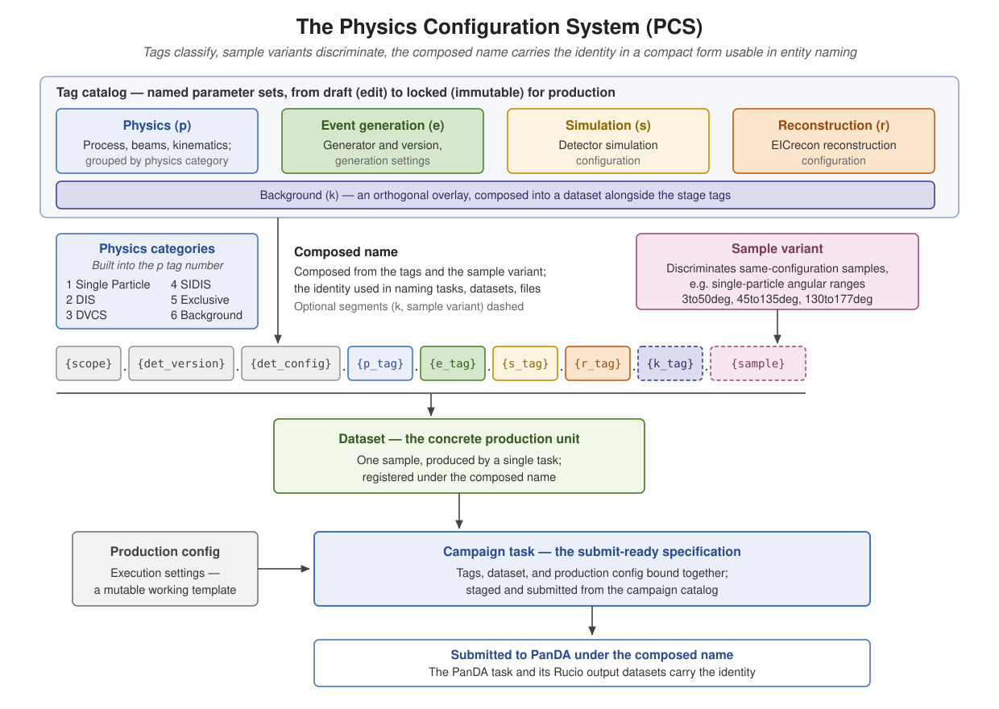](diagrams/pcs_system.svg)

<!-- AI-directed description of pcs_system.svg, hidden from the rendered page: the diagram content stated as text so it need not be re-inferred from the image.
Conceptual diagram of the Physics Configuration System and how its composed name flows to PanDA. Title: "The Physics Configuration System (PCS)"; subtitle: "Tags classify, sample variants discriminate, the composed name carries the identity in a compact form usable in entity naming". A top container, "Tag catalog — named parameter sets, from draft (edit) to locked (immutable) for production", holds four stage tag boxes: Physics (p) (Process, beams, kinematics; grouped by physics category, blue), Event generation (e) (Generator and version, generation settings, green), Simulation (s) (Detector simulation configuration, yellow), Reconstruction (r) (EICrecon reconstruction configuration, orange), plus a violet bar "Background (k) — an orthogonal overlay, composed into a dataset alongside the stage tags". Below left, a "Physics categories" box (Built into the p tag number) lists 1 Single Particle, 2 DIS, 3 DVCS, 4 SIDIS, 5 Exclusive, 6 Background. Center text explains the Composed name: composed from the tags and the sample variant; the identity used in naming tasks, datasets, files; optional segments (k, sample variant) shown dashed. Right, a pink "Sample variant" box: discriminates same-configuration samples, e.g. single-particle angular ranges 3to50deg, 45to135deg, 130to177deg. A monospace chip row spells the name with dot separators: {scope}.{det_version}.{det_config}.{p_tag}.{e_tag}.{s_tag}.{r_tag}.{k_tag}.{sample}, each tag chip colored to match its catalog box, with {k_tag} and {sample} dashed as optional. A gathering line funnels into "Dataset — the concrete production unit" (One sample, produced by a single task; registered under the composed name), then down to "Campaign task — the submit-ready specification" (Tags, dataset, and production config bound together; staged and submitted from the campaign catalog), which also receives "Production config" (Execution settings — a mutable working template) from the left. The final box: "Submitted to PanDA under the composed name" (The PanDA task and its Rucio output datasets carry the identity). Takeaway: locked tags plus sample variant compose one canonical name that carries physics identity from configuration through dataset, task, and PanDA/Rucio products.
-->

### The Validation Loop

In [Validation](validation.md) — availability, Hydra validation, AI assessment, record, and expert signoff between the WFMS and ePIC validation; proposal-stage interfaces dashed.

[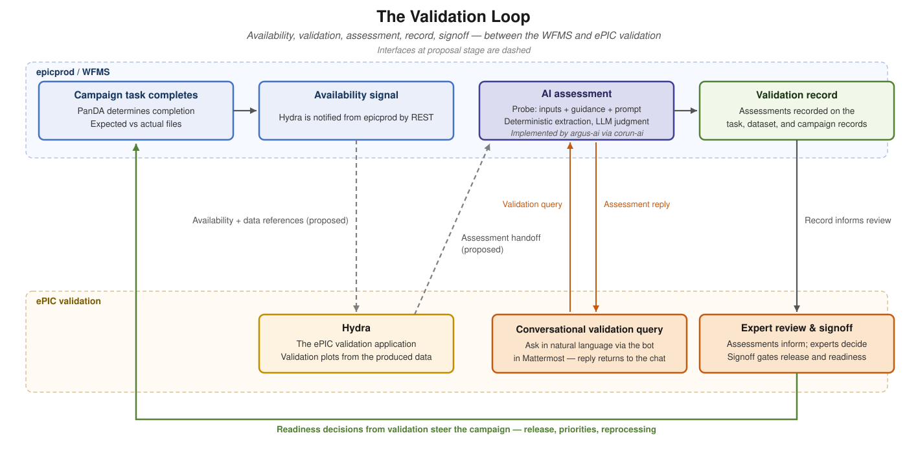](diagrams/validation_loop.svg)

<!-- AI-directed description of validation_loop.svg, hidden from the rendered page: the diagram content stated as text so it need not be re-inferred from the image.
Flow diagram of the proposed validation loop between the WFMS and ePIC validation. Title: "The Validation Loop"; subtitle: "Availability, validation, assessment, record, signoff — between the WFMS and ePIC validation"; a note adds "Interfaces at proposal stage are dashed". Two dashed zones: "epicprod / WFMS" across the top and "ePIC validation" across the bottom. Top row, left to right: "Campaign task completes" (PanDA determines completion; Expected vs actual files) → "Availability signal" (Hydra is notified from epicprod by REST) → then a dashed arrow drops into the validation zone labeled "Availability + data references (proposed)" to "Hydra" (The ePIC validation application; Validation plots from the produced data). A dashed arrow returns upward labeled "Assessment handoff (proposed)" to "AI assessment" (Probe: inputs + guidance + prompt; Deterministic extraction, LLM judgment; Implemented by argus-ai via corun-ai) → "Validation record" (Assessments recorded on the task, dataset, and campaign records). From the record a solid arrow labeled "Record informs review" drops to "Expert review & signoff" (Assessments inform; experts decide; Signoff gates release and readiness) in the validation zone. Also in the validation zone, "Conversational validation query" (Ask in natural language via the bot in Mattermost — reply returns to the chat) exchanges paired orange arrows with AI assessment: "Validation query" up and "Assessment reply" down. A green loop runs from Expert review & signoff along the bottom and back up into "Campaign task completes", captioned "Readiness decisions from validation steer the campaign — release, priorities, reprocessing". Takeaway: task completion triggers Hydra validation and AI assessment whose recorded results inform expert signoff, and those human readiness decisions feed back to steer the campaign; the WFMS-to-Hydra interfaces are still proposals.
-->

### The WFMS Timeline

In [Timeline](timeline.md) — the three-year plan and the decade arc to physics datataking.

[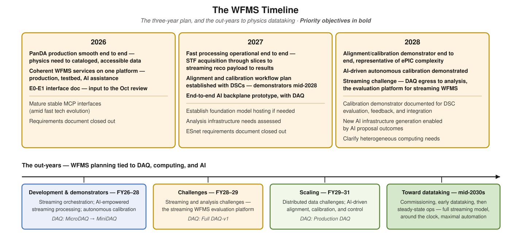](diagrams/wfms_timeline.svg)

<!-- AI-directed description of wfms_timeline.svg, hidden from the rendered page: the diagram content stated as text so it need not be re-inferred from the image.
This diagram depicts the WFMS three-year plan and its out-years through physics datataking; it is the program's planning and milestone picture. Title: "The WFMS Timeline"; italic subtitle: "The three-year plan, and the out-years to physics datataking · Priority objectives in bold". Layout: three amber year cards across the top, then an out-years heading, a horizontal arrow with four ticks, and four period cards. Each year card lists bold priority objectives above a divider line and regular items below. "2026" bold: PanDA production smooth end to end — physics need to cataloged, accessible data; coherent WFMS services on one platform — production, testbed, AI assistance; E0-E1 interface doc — input to the Oct review. Regular: mature stable MCP interfaces (amid fast tech evolution); requirements document closed out. "2027" bold: fast processing operational end to end — STF acquisition through slices to streaming reco payload to results; alignment and calibration workflow plan established with DSCs — demonstrators mid-2028; end-to-end AI backplane prototype, with DAQ. Regular: establish foundation model hosting if needed; analysis infrastructure needs assessed; ESnet requirements document closed out. "2028" bold: alignment/calibration demonstrator end to end, representative of ePIC complexity; AI-driven autonomous calibration demonstrated; streaming challenge — DAQ egress to analysis, the evaluation platform for streaming WFMS. Regular: calibration demonstrator documented for DSC evaluation, feedback, and integration; new AI infrastructure generation enabled by AI proposal outcomes; clarify heterogeneous computing needs. Below, the heading "The out-years — WFMS planning tied to DAQ, computing, and AI" sits above a rightward timeline arrow and four cards: blue "Development & demonstrators — FY26–28" (streaming orchestration; AI-empowered streaming processing; autonomous calibration; italic "DAQ: MicroDAQ → MiniDAQ"); amber "Challenges — FY28–29" (streaming and analysis challenges — the streaming WFMS evaluation platform; italic "DAQ: Full DAQ-v1"); light-green "Scaling — FY29–31" (distributed data challenges; AI-driven alignment, calibration, and control; italic "DAQ: Production DAQ"); green "Toward datataking — mid-2030s" (commissioning, early datataking, then steady-state ops — full streaming model, around the clock, maximal automation). Takeaway: three years of concrete WFMS milestones feed a staged progression of demonstrators, challenges, and scaling, tracking DAQ generations toward fully automated streaming operations in the mid-2030s.
-->

### Streaming Computing Planning — FY25–FY31

In [Timeline](timeline.md) — the joint DAQ, computing, and AI planning lanes, the context for the WFMS out-years.

[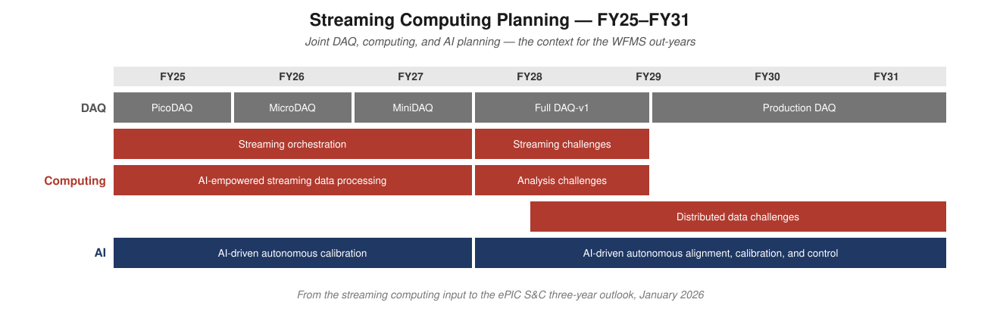](diagrams/streaming_planning_fy.svg)

<!-- AI-directed description of streaming_planning_fy.svg, hidden from the rendered page: the diagram content stated as text so it need not be re-inferred from the image.
This diagram depicts a fiscal-year Gantt chart of joint DAQ, computing, and AI planning for streaming computing; it supplies the multi-year context behind the WFMS out-years. Title: "Streaming Computing Planning — FY25–FY31"; italic subtitle: "Joint DAQ, computing, and AI planning — the context for the WFMS out-years". Layout: a gray header row of fiscal-year columns FY25 through FY31, with three labeled lanes of colored bars beneath; there are no arrows. DAQ lane (gray bars, one per period): "PicoDAQ" in FY25, "MicroDAQ" in FY26, "MiniDAQ" in FY27, "Full DAQ-v1" spanning FY28 into early FY29, and "Production DAQ" from FY29 through FY31. Computing lane (dark red bars, three rows): row one, "Streaming orchestration" spanning FY25 through FY27, then "Streaming challenges" spanning FY28 into FY29; row two, "AI-empowered streaming data processing" spanning FY25 through FY27, then "Analysis challenges" spanning FY28 into FY29; row three, "Distributed data challenges" from mid-FY28 through FY31. AI lane (dark navy bars): "AI-driven autonomous calibration" spanning FY25 through FY27, then "AI-driven autonomous alignment, calibration, and control" spanning FY28 through FY31. Color semantics are lane identities: gray for DAQ, dark red for computing, dark navy for AI. An italic attribution line at bottom reads: "From the streaming computing input to the ePIC S&C three-year outlook, January 2026". Takeaway: development-phase streaming orchestration, AI-empowered processing, and autonomous calibration run through FY27, pivot to challenge campaigns as Full DAQ-v1 arrives in FY28, and broaden to distributed data challenges and full AI-driven alignment, calibration, and control alongside Production DAQ through FY31.
-->

### PCS Data Model
[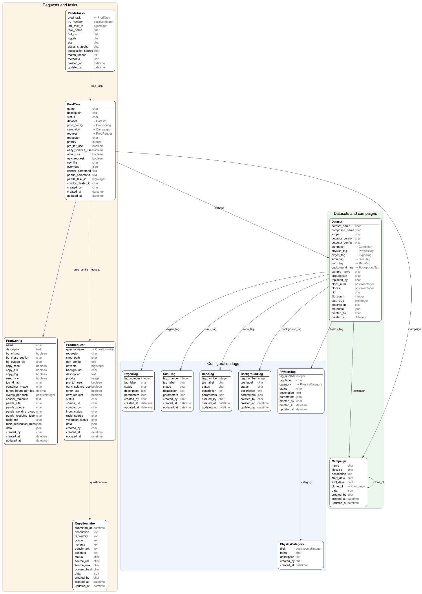](diagrams/pcs_data_model.svg)

<!-- AI-directed description of pcs_data_model.svg, hidden from the rendered page: the diagram content stated as text so it need not be re-inferred from the image.
Graphviz entity-relationship diagram of the PCS Django data model, showing every model, field, and foreign key. No prose title; three shaded clusters group the nodes. Cluster "Configuration tags" (light blue) holds PhysicsCategory (digit positivesmallinteger, name char, description text, created_by char, created_at datetime), PhysicsTag (tag_number integer, tag_label char, category FK to PhysicsCategory, status char, description text, parameters json, created_by, created_at, updated_at), and EvgenTag, SimuTag, RecoTag, BackgroundTag, each with the identical field set tag_number integer, tag_label char, status char, description text, parameters json, created_by char, created_at and updated_at datetimes. Cluster "Datasets and campaigns" (light green) holds Dataset (dataset_name, composed_name, scope, detector_version, detector_config chars; campaign FK to Campaign; physics_tag, evgen_tag, simu_tag, reco_tag, background_tag FKs to the five tag models; sample_name, propagation, replaced_by chars; block_num and blocks positiveintegers; did char; file_count integer; data_size biginteger; description text; metadata json; created_by, created_at) and Campaign (name char, lifecycle char, description text, start_date and end_date dates, clone_of self-FK to Campaign, data json, created_by, created_at, updated_at). Cluster "Requests and tasks" (cream) holds ProdConfig (name, description, bg_mixing boolean, bg_cross_section, bg_evtgen_file chars, copy_reco, copy_full, copy_log, use_rucio booleans, jug_xl_tag, container_image chars, target_hours_per_job decimal, events_per_task positiveinteger, condor_template text, panda_site, panda_queue, panda_working_group, panda_resource_type, rucio_rse chars, rucio_replication_rules json, data json, created_by, created_at, updated_at); ProdRequest (questionnaire FK to Questionnaire, requestor, simu_path chars, gen_config text, nevents biginteger, background char, description text, priority integer, pre_tdr_use, early_science_use, other_use, new_request booleans, status, source_url, source_row, input_status, rucio_source, validation_status chars, data json, created_by, created_at, updated_at); Questionnaire (submitted_at datetime; description, repository, contact, nevents, benchmark, estimate texts; status, source_url, source_row, content_hash chars; data json; created_by, created_at, updated_at); ProdTask (name char, description text, status char, dataset FK to Dataset, prod_config FK to ProdConfig, campaign FK to Campaign, request FK to ProdRequest, requestor char, priority integer, pre_tdr_use, early_science_use, other_use, new_request booleans, csv_file char, overrides json, condor_command and panda_command texts, panda_task_id biginteger, condor_cluster_id char, created_by, created_at, updated_at); and PandaTasks (prod_task FK to ProdTask, try_number positiveinteger, jedi_task_id biginteger, task_name, out_ds, log_ds, site, status_snapshot, association_source chars, match_reason text, metadata json, created_at, updated_at). Edges, each labeled with its field name: PhysicsTag to PhysicsCategory (category); Dataset to Campaign and to all five tag models; Campaign to itself (clone_of); ProdRequest to Questionnaire; ProdTask to Dataset, ProdConfig, Campaign, and ProdRequest; PandaTasks to ProdTask. Takeaway: ProdTask is the binding node joining a Dataset (which carries the five-tag physics identity), a ProdConfig, a Campaign, and the originating ProdRequest, with PandaTasks recording each PanDA submission attempt against it.
-->
