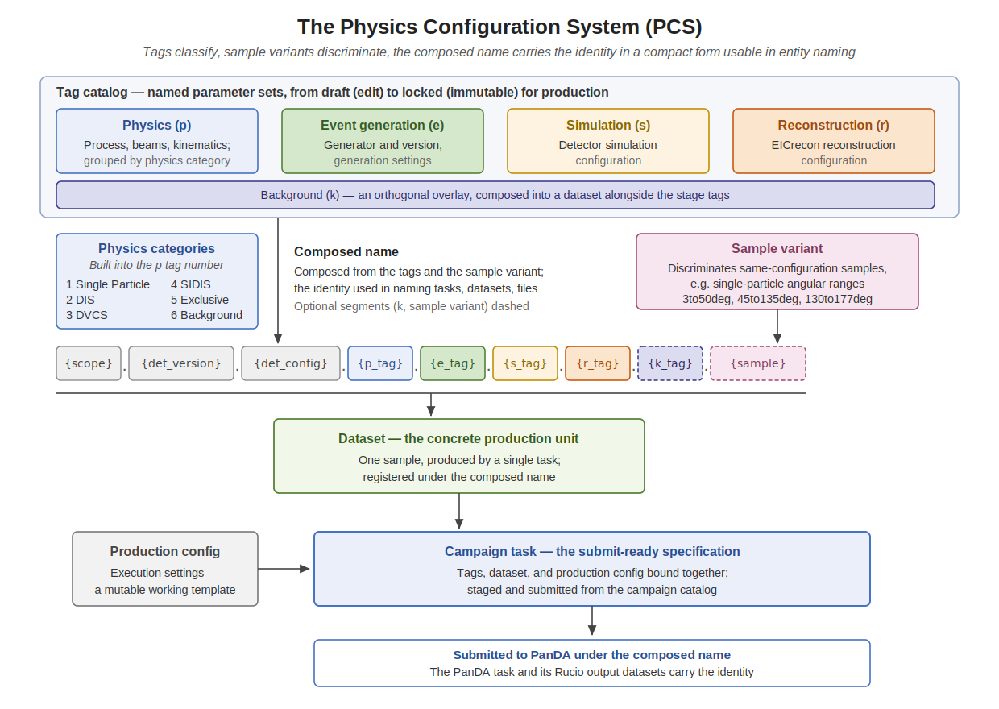
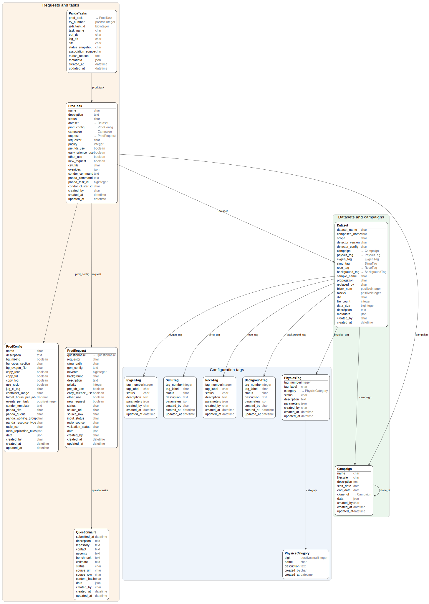

# Physics Configuration System

This section documents the Physics Configuration System (PCS), the configuration layer of epicprod and the principal
place where physicists meet the production system: the tag catalog of physics and processing definitions, the datasets
and sample variants composed from them, the composed-name identity, and the browse and compose interface from which
production tasks are built and submitted.

## The Configuration Layer

PCS is the catalog of physics and processing definitions from which production tasks are composed, and the system of
record for what those definitions mean. Like all of epicprod it is part of the ePIC PanDA infrastructure at BNL,
proxied for open collaboration access, and it serves PanDA use beyond production: the streaming workflow testbed and
the AID2E detector-design project compose PanDA work from the same catalog. The working vocabulary — tags, datasets,
sample variants, production configs, and the composed name — is defined in [Concepts](concepts.md); this section
describes the system built on it, with implementation detail in
[PCS.md](https://github.com/BNLNPPS/swf-epicprod/blob/main/docs/PCS.md).

## Tags and the Tag Catalog

Four tag types classify the stages of production — physics (p), event generation (e), simulation (s), and
reconstruction (r) — organized under physics categories, each tag carrying a parameter set appropriate to its type.
The fifth type, background (k), is an orthogonal overlay: backgrounds compose into datasets alongside the stage tags,
keeping signal and background configurations independent and avoiding the tag explosion of signal-background
combinatorics.

Tags follow the draft-refine-lock lifecycle: a draft tag is editable by its owner, and a locked tag is immutable and
production-ready — a stable reference whose meaning never changes. The whole ePIC production record, current and past
campaigns alike, is expressed on the tag basis, so the catalog is both the configuration source for new production and
the classification of everything already produced.

## Datasets, Variants, and Identity

Datasets bind tags into a defined data product — one sample, produced by a single task — with sample variants
discriminating same-configuration samples produced separately. The composed name built from these entities carries the
identity in a compact form usable in entity naming — tasks, datasets, and files: catalog pages, links, the API, the
PanDA task name, and the Rucio output namespace all carry it, as diagrammed above and specified in
[Concepts](concepts.md). Production configs complete the
picture on the execution side: reusable, deliberately mutable templates of software stack, resource, and splitting
settings.

## Browse and Compose

The PCS interface is a two-pane browse and compose view, open read-only to the whole collaboration: a filterable
entity browser — search, parameter selectors, tag type selection — beside the detail and edit pane for the selected
entity. Ownership sets what a login can do: owners can edit, copy, lock, and delete their draft entities, and anyone
can copy anything, including entities they do not own.

Copy and edit is the intended working style. A physicist copies the tag closest to what they need — the copy takes a
new auto-incremented label — edits the parameters, choosing from configured values or adding custom ones, and saves.
While composing, browsing other tags shows field-by-field which values differ from the entity being edited, and a
differing value can be adopted with a click. The same derivation style scales up: a campaign's tasks can be cloned
and adjusted for the next campaign rather than rebuilt.

## From Tags to Submitted Tasks

Task composition binds tags, dataset, and production config into a campaign task — the submit-ready specification
described in [Production System](production.md). Submission is one click from the compose view: the task
specification is generated from the composed entities and submitted through the credentialed production operations
agent using the PanDA client API, and the returned PanDA task ID is recorded on the campaign task for tracking and
monitoring.

## From Request to Configuration

Production requests reach PCS through the triage described in [Production System](production.md): an operator links
the request to the tags and datasets that realize it. The mapping is a human operations process at present; as the
request form becomes more structured, the request-to-configuration mapping becomes more programmatic.

## The PCS Data Model

The data model as implemented, generated from the live Django models:
every entity with all of its fields and relations. The same schema in
database form is the repository's generated
[testbed-schema.dbml](https://github.com/BNLNPPS/swf-monitor/blob/main/testbed-schema.dbml).

