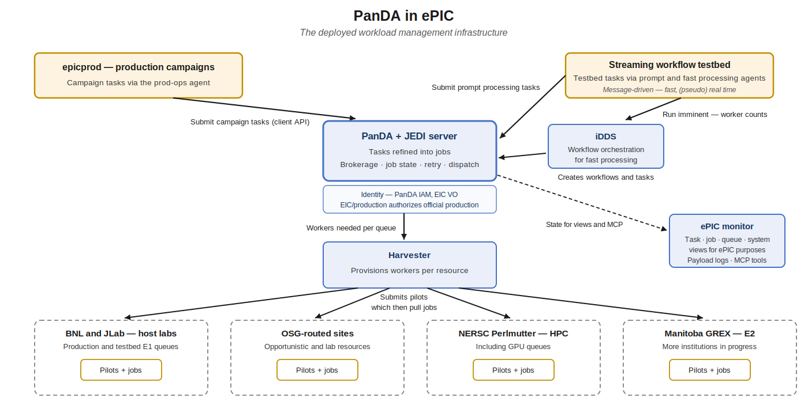
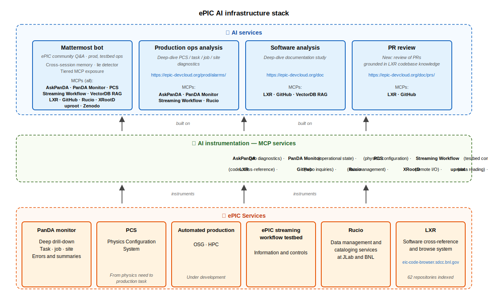
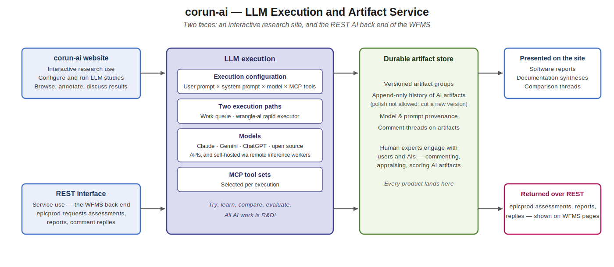
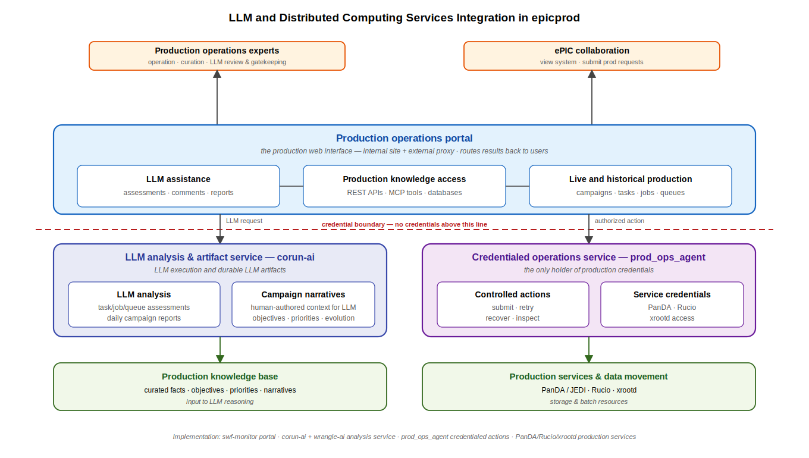

# WFMS Platform

This section covers the specific technical platform used to build the ePIC WFMS across streaming, production, validation,
distributed analysis, calibration, distributed CI, and related workflow domains. It marks the passage from
technology-agnostic architecture to implementation specifics. It documents the concrete systems,
services, libraries, interfaces, and conventions used to realize the architecture described in the previous section.

The platform is developing through two active implementation fronts: the streaming workflow testbed and the epicprod production system. These
fronts have different near-term purposes, but they are deliberately based on the same foundation: PanDA and related
workflow services, Rucio and XRootD data handling, message-driven agents, a shared monitor/database service, REST and
MCP interfaces, browser-based operational pages, AI bot interfaces, and harnessed LLM AI services.

## Production and Testbed Convergence

The two implementation fronts exercise complementary parts of the platform. Production carries the immediate
operational needs: campaign definition, task creation, PanDA execution, data product accounting, monitoring, human
controls, and operations automation. The testbed exercises the datataking side: E0-E1-E2 streaming processing, message-driven agents,
fast processing, Rucio data handling, and prompt monitoring.

Several production components serve the testbed as well. The Physics Configuration System (PCS) provides a dynamic,
editable, composable catalog for task creation. Rucio-based input ingest and PanDA submission are production
needs today and testbed needs for composed streaming-processing tasks. The task catalog's browsing, state, controls, and copy/edit
capabilities can extend to testbed namespaces, data challenges, and future streaming exercises.

The ePIC-specific monitor originated in the testbed and now supports both fronts. Bot interfaces, alarms, operations
agents, MCP tools, and LLM-backed assessment services are likewise shared, with authorization and action policies set
per domain.

## Repository Organization

The `swf-*` repositories implement the current platform. `swf-testbed` is the umbrella repository for testbed
configuration, orchestration, and documentation. `swf-monitor` is the central web and database application, covering
monitoring, APIs, and the epicprod implementation. `swf-common-lib` holds shared agent, messaging, logging, and Rucio
helper code; code used by more than one component belongs there. Agent repositories (`swf-daqsim-agent`,
`swf-data-agent`, `swf-processing-agent`, `swf-fastmon-agent`) implement specific testbed roles. The fast-processing
worker layer is implemented in `swf-transform` (the worker-node payload transformation, processing slice messages
through the reconstruction payload) and `swf-panda-workers` (worker lifecycle coordination with iDDS and PanDA).

The three core repositories (`swf-testbed`, `swf-monitor`, `swf-common-lib`) advance together on coordinated branches.

## Web and Database Stack

### swf-monitor

`swf-monitor` serves both the testbed and epicprod; the historical name now covers much more than monitoring. It is a
Django application backed by PostgreSQL, providing the platform's browser pages, REST APIs, and MCP tools and the
database-backed state beneath them: message history, agent state, PanDA monitoring views, PCS, task catalogs, and LLM
assessment integration.

### Database-Backed Operational State

The monitor database stores all operational state that must be queried, filtered, linked, audited, or rendered, holding
current state and its history. Testbed records include runs, agents, messages, files, workflow executions, and fast
monitoring state. Production records include requests, PCS entities, campaign tasks, PanDA associations, operator
state, cached system status, LLM artifact pointers, and production metadata.

Django models and migrations define the schema. JSON fields hold extensible metadata; structured fields are used where
filtering, linking, constraints, or operator workflows require them. The pervasive use of JSON fields makes the
system flexible and adaptable to include new knowledge, state and functionality.

### Browser Pages

Pages are server-rendered Django templates with targeted JavaScript for filtering, selection, asynchronous actions, and
notification. Page state that affects interpretation (selected task, active tab, filters, sorting) is carried in the
URL, making views bookmarkable and stable as references.

Pages that have buttons triggering long-running or credentialed work enqueue an agent request and return promptly,
not waiting for completion; completion arrives through database state and immediate browser notification with
an auto-updated page.

### Server-Sent Events

Server-Sent Events (SSE) deliver asynchronous completion notices to the browser. swf-monitor consumes message-bus
events, persists relevant messages, and relays selected events to browsers through `/api/messages/stream/`.
Operations-agent completions and corun-ai callbacks reach production pages the same way. SSE carries only the
notification; on receipt, pages refresh their state from the database or REST.

## Workflow and Workload Management

### PanDA

PanDA[^panda] is the distributed workload management system for both fronts: it turns task specifications into jobs, brokers
work to sites, and records task and job state. epicprod uses it for campaign tasks; the testbed uses it to execute
prompt and streaming workflows.

swf-monitor presents PanDA task and job state through task, job, queue, and system views tailored to ePIC,
supplanting the default ATLAS PanDA monitor with production task links, campaign context, payload-log access, Rucio
output views, and LLM assessments.

### JEDI

JEDI is the PanDA task definition and execution layer, used for direct production task submission from PCS. PCS builds
the task specification, maps its fields into a JEDI `taskParamMap`, and queues the credentialed submission through the
production operations agent. The live epicprod path uses the PanDA client API for EVGEN production tasks and records
each physical submission attempt as a PanDA task association.

The integration separates logical campaign task identity from physical PanDA/Rucio attempt names. The logical identity
remains stable in PCS; physical submissions may append `.tryN` so that reruns have unique PanDA
task names and output namespaces, and/or `.bN` to organize blocks of outputs within a task when very large tasks would
exceed Rucio's maximum dataset size (100k files).

### iDDS

iDDS[^idds], part of the PanDA ecosystem, is PanDA's workflow management component,
orchestrating multi-stage and data-driven workflows in which data availability,
transformation, and workflow state must be coordinated beyond single task submission. It is capable of large and
complex workflows, able to handle future streaming and production workflow expansion.
PanDA also has an internal workflow capability under development, for workflows integral to PanDA's management of
an overall task; PanDA has full and direct awareness and control of a multi-stage task, rather than delegating to iDDS.
As this capability matures it will be reviewed for possible application in ePIC WFMS. The complex workflows of
ePIC fast streaming processing will always be an iDDS domain.

### Workflow Descriptions

The testbed uses a layered workflow model: TOML for human-editable configuration and parameters, Python/SimPy for
execution and simulation patterns that need rapid iteration, and Snakemake as the layer where dependency
management is central, as in calibration and other multi-step orchestration. Snakemake integration for real ePIC
calibration and CI workflows is well advanced: a Snakemake executor plugin for PanDA is published, ePIC benchmark
workflows have run in CI through an HTCondor executor, and the first eicweb CI jobs have submitted work to BNL
through PanDA.

## Data Management

### Rucio

Rucio[^rucio] is the distributed data management system of ePIC and of the platform. In the testbed it manages run datasets, super time
frame (STF) file registration, subscriptions, transfer rules and execution, and Rucio Storage Element (RSE) state. In production it
records and exposes production data products (EVGEN inputs, RECO outputs, and log datasets).
Rucio DIDs (dataset identifiers), scopes, RSEs, rules, replicas, and metadata are operational objects,
presented beside workflow state in monitor pages and task catalogs.

### XRootD and FTS

XRootD is the file access and transfer protocol for the testbed and production paths. Rucio drives data movement through
FTS (the File Transfer Service); agents also use XRootD directly for direct read operations, including
over distributed sites.

### Production Science-Data Constraint

The BNL PanDA server used for ePIC production is configured with an associated Rucio instance, BNL Rucio, where PanDA
records logs. ePIC production science data is held in JLab Rucio. Production payloads therefore handle science data
movement and registration directly against JLab Rucio on both the input and output sides, with PanDA not directly
involved in science data resolution, transfer, and registration for production operations. Rucio operations may be
consolidated on a single PanDA-coupled instance in the future.
Payload-side data handling uses standard PanDA/Rucio copytools for worker node data movement.
The monitor includes built-in access and presentation of Rucio-based science and log data.

### Data Product Cataloging

Data products are cataloged and curated as the primary product of the production process.
Production campaign tasks link to expected and observed outputs:
Rucio DIDs, output status, logs, and PanDA task associations. The testbed records run, STF, time frame (TF), and
workflow-stage metadata. Workflow state and data-product state are inspectable together.

## Distributed Resources Integration

The platform expresses the Echelon model defined in Foundations through workflow processing destinations,
a prompt processing 'decision box' determining E1 processing, data locations, site state,
queue state, and monitoring views. The same abstractions serve present testbed emulation and future distributed facility scale
operation.

PanDA represents compute resources as sites and queues; Harvester and the pilot infrastructure connect PanDA tasks to
the site execution layer, typically a batch system. swf-monitor presents task, job, queue, site, resource usage, and
harvester-worker state so that failures can be diagnosed at the level of the campaign task, PanDA task, job, queue, or
site.

The testbed emulates elements of the E0-E1-E2 workflow with local services and configured RSEs. DAQ buffer and E1
storage roles are represented by distinct RSEs and XRootD paths even when implemented on the same host during
development, so workflow and dataflow logic can be exercised before the physical facilities and final data paths exist.

## Metadata and APIs

REST APIs are the programmatic interface for browser pages, scripts, agents, service-to-service calls, and automation;
command-line clients and operational scripts work through REST endpoints rather than Django internals or direct
database queries. Endpoints return structured errors, preserve stable identifiers, and represent the same state shown
in the browser. Write actions that must work through the remote proxy use a proxy-safe shape: JSON response, no session
or CSRF dependence the proxy cannot carry, and no redirect as the action result.

MCP (Model Context Protocol) tools are the corresponding structured interface for LLM clients, exposing testbed state,
production state, PanDA monitoring, PCS entities, LLM artifacts, and selected bounded actions. swf-monitor serves MCP
from a FastMCP ASGI worker separate from the Django WSGI site. Tools are designed as data access and bounded-action
primitives: list tools support filtering, pagination, and stable identifiers, and action tools route through the same
service layer and agent execution paths as browser and REST actions. Tool docstrings are operational metadata: they are
the primary text an LLM reads when deciding what to call.

Both interfaces rest on stable identifiers: campaign task composed names, JEDI task IDs, PanDA job IDs, Rucio DIDs, RSE
names, agent names, workflow execution IDs, section slugs, and document artifact group IDs. JSON metadata identifies
the source system, artifact type, subject reference, producing user or service, and, for LLM-generated artifacts, model
and prompt provenance.

### AI Tool Coverage

The MCP instrumentation has grown out of the WFMS work into broad coverage of the systems ePIC AI clients need:
PanDA job diagnostics and operational state, PCS physics configuration, testbed control, read-only database inquiry,
Rucio data management, XRootD remote I/O and uproot data reading, code cross-reference over the ePIC software repositories (LXR), GitHub
repository inquiries, embedded-documentation retrieval, and Zenodo documents. AI services are built on this
instrumentation: the Mattermost bot serving collaboration-wide questions on production and testbed operations,
production operations analysis with drill-down diagnostics, software documentation analysis, and pull-request review
grounded in codebase knowledge. The stack — ePIC services, MCP instrumentation, AI services — is diagrammed below.

## Agents and Services

### Agent Infrastructure

`BaseAgent` in `swf-common-lib` is the shared agent base, providing STOMP/ActiveMQ integration, monitor registration,
heartbeats, namespace filtering, message dispatch, REST logging, and background execution. Agents built on it are
visible in the monitor and follow common message and status conventions. `BaseAgent.run_in_background()` gives handlers
a bounded worker pool for calls into subprocesses, REST services, Rucio, and XRootD, keeping the single receiver thread
responsive to liveness and control messages while slow work completes.

A precept throughout the system is no silent failures: an error always produces a visible consequence and informative
logging for diagnostics. BaseAgent carries this into the agent layer with REST logging into the monitor, heartbeat and
status reporting, and message-level error handling; across the platform, handlers, parsers, and service calls report
errors into logs, user-visible messages, or operational summaries.

ActiveMQ Artemis is the message broker. Topics carry broadcast events; queues deliver anycast work. Testbed workflow
messages use broadcast topics for events such as run state and STF availability; production operations use an anycast
control queue for single-consumer credentialed work. Destination names carry the explicit `/topic/` or `/queue/`
prefix, and the choice between topic and queue follows the delivery semantics. Durable subscriptions are used sparingly
because they create broker-side state and can accumulate messages.

### Workflow and Operations Agents

The testbed agent set models the streaming workflow. `swf-daqsim-agent` simulates DAQ state and STF generation.
`swf-data-agent` receives DAQ messages, creates run datasets, manages Rucio STF handling, and notifies processing and
fast monitoring. `swf-processing-agent` submits and manages PanDA processing tasks. `swf-fastmon-agent` consumes STF
availability, samples TF-level information, records metadata through REST, and publishes notification events for
real-time monitoring.

`epicprod_ops_agent` is the always-on credentialed executor for production. The web tier, REST endpoints, MCP tools,
bots, and scheduled jobs request work; the agent performs the privileged actions, currently including PanDA submission,
payload-log retrieval, Rucio snapshot updates, and PanDA task operations. It follows a handler-plus-doer pattern: the
handler validates and queues work, and a doer script performs the credentialed operation as a subprocess. Capabilities
remain reusable from cron and operator scripts, and privileged service logic stays out of the browser request path.

### Bot Interfaces

The bot interface is a natural-language chat layer over MCP tools and selected REST-backed operations. Bots run as
persistent services with conversational access to the same structured state the browser and REST interfaces expose:
testbed status, PanDA tasks and jobs, queues, PCS entities, and LLM artifacts, so operational questions get answers
grounded in live system state.

Bot authority is a per-domain policy: the production bot informs, assesses, and answers, while workflow actions remain
with operators and the operations agent; a testbed bot or testbed mode can be more active where that suits workflow
experimentation. As confidence in harnessed AI operation grows, bots are a natural interface for exercising the same
bounded action paths that humans operate, following the AI integration approach set out in Architecture.

### Alarms

The alarm system concentrates operator attention where it is needed. Alarms are derived from monitored state, attached
to the relevant object or service, and visible in both detail and summary views. Alarm conditions are operator-defined
and held in an alarm registry, evaluated on a frequent schedule against monitor state, with triggered alarms notifying
by email as well as appearing in the views. It is the first alarm system fielded in the PanDA ecosystem.

Alarms serve the minimal-effort operations goal: automation handles routine conditions, and the alarm stream defines
what needs human or AI attention. The capability applies to production operations now and extends to testbed and
eventual E0-E1 operations, where streaming latencies demand automated detection and notification.

### corun-ai and wrangle-ai

corun-ai is the LLM execution and durable artifact service of the platform, central to its AI integration: much of the
AI functionality of the WFMS will be delivered through it. It runs LLM work under its own credentials and configuration
(models, prompts, execution environment) and holds the results as durable document artifacts carrying model and prompt
provenance.

For epicprod, swf-monitor supplies production context and renders the production-facing pages while corun-ai stores and
serves the LLM artifacts: assessments of tasks, jobs, queues, and campaigns; LLM replies in comment discussions;
human-authored campaign narratives that give LLMs context for reasoning; and daily campaign reports analyzing status
and progress. Its current applications are codoc-ai, producing on-request analyses of production, site performance,
and failure modes, and argus-ai, the validation assessment application described in Validation. swf-monitor records
pointers to these artifacts rather than copying generated content into production records. This implements the architectural rule that AI outputs become artifacts in the system: attached to the
relevant object, open to comment, and available as context for later assessments and reports. The role grows with the
system; assessment coverage across workflow domains, deeper diagnostics, campaign reporting, and testbed analytics on
streaming workflow behavior all build on the same service.

wrangle-ai is the rapid asynchronous executor for bounded LLM operations such as comment replies and assessment probes.
For browser-triggered LLM operations, swf-monitor calls corun-ai over REST, corun-ai creates and executes a work item,
and completion returns to swf-monitor through a callback converted into an SSE browser notification: LLM results reach
the requesting page the moment they complete.

## Authentication

Browser access is authenticated according to deployment surface. The internal `pandaserver02` site uses BNL-facing
authentication; the external proxy at `epic-devcloud.org/prod` provides collaboration access through swf-remote and the
production URL prefix. Browser authorization distinguishes read-only access, production request actions, operator
actions, and privileged service execution.

Service credentials are held by the service that needs them. PanDA OIDC tokens, Rucio x509 proxies, XRootD access
credentials, and LLM service tokens live in the environment of the agent or service that uses them. Privileged
production actions route through `epicprod_ops_agent`: the web tier reads database state and world-readable cache
artifacts and enqueues work, while PanDA, Rucio, and XRootD operations with production credentials run only in the
agent. MCP observes the same boundary as an API surface whose action tools enqueue work for the agent.

The external proxy is part of the production surface and an implementation constraint. URLs intended for external
collaborators work under `/prod/`; write actions that pass through the proxy use the proxy-safe REST patterns above;
and pages make remote limitations visible where a control is available only on `pandaserver02`.

BNL internal services use a private certificate chain, so platform scripts and agents use a combined trust bundle that
verifies both BNL services and public HTTPS endpoints. Certificate and proxy configuration belongs in deployment
configuration and agent environments.

[^panda]: PanDA: Production and Distributed Analysis system. Documentation: <https://panda-wms.readthedocs.io/> · paper: <https://link.springer.com/article/10.1007/s41781-024-00114-3>

[^rucio]: Rucio: A Distributed Data Management System. <https://link.springer.com/article/10.1007/s41781-019-0026-3>

[^idds]: iDDS: intelligent Data Delivery Service. <https://link.springer.com/article/10.1140/epjc/s10052-025-15275-7>
