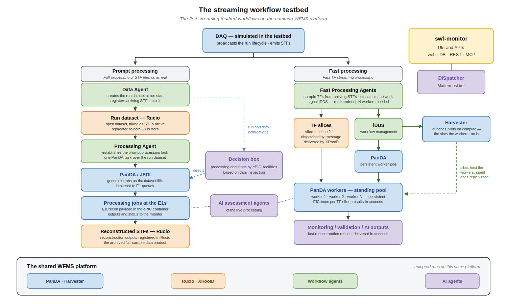
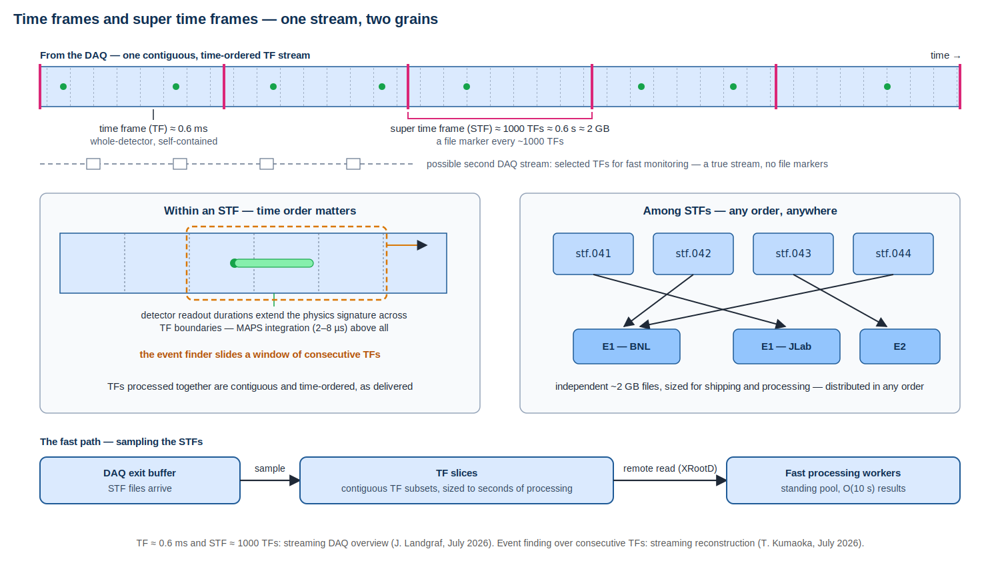

# Streaming Workflows

This section documents the post-DAQ workflows of datataking: the E0-E1 dataflow, time frame and super time frame
processing, fast processing for low-latency control room and AI analytics, prompt processing of STFs, streaming
reconstruction integration, fast monitoring, E2 participation in streaming workflows, and the current realization of
these workflows in the streaming workflow testbed.

The testbed operates this scope — right of the red line — through its first two workflows on the common WFMS
platform: prompt processing of STF files on arrival, and fast TF streaming processing on persistent
PanDA-managed workers.

## E0-E1 Interface — Controls and Dataflows

The E0-E1 interface is where WFMS responsibility begins. The DAQ system is one system spanning two facilities: the DAQ
room at IP6 and the DAQ enclave in the BNL data center, connected at 4 Tbps. Super time frame (STF) files are built in
the DAQ enclave and land in the DAQ exit buffer, sized for about 72 hours of datataking. The buffer extends beyond the
enclave onto an external subnet for E1 delivery; this outward face is the piece of Echelon 0 that the post-DAQ world
sees, and the WFMS scope runs from it rightward through E1 processing.[^streaming-computing-model]

Two dataflows leave the exit buffer. The STF stream is the complete raw data: STF files are registered in Rucio at the
exit buffer and delivered to the E1 buffers at both BNL and, over ESnet at 400 Gbps, JLab, establishing the two
geographically separated raw-data copies of the butterfly model. The E1 buffers serve the full-sample consumers:
archiving, prompt processing, and prompt monitoring. The TF stream is a fast subsample delivered at finer granularity,
with data available to E1 consumers within a few seconds of datataking; it feeds fast monitoring and fast processing.
Candidate TF delivery mechanisms are messaging and direct XRootD reads against the exit buffer.

Control signals cross the interface alongside the data. Datataking state — collider, detector, DAQ and calibration
state, definitive in E0 and mirrored in E1 — is carried as operational metadata on the data and messages crossing the
interface; the [datataking state machine](#the-datataking-state-machine) defines it. The run lifecycle — run imminent,
run start, pause and resume, run end — is broadcast from the DAQ side and drives downstream orchestration: dataset
creation, processing task establishment, worker provisioning, and run closeout all key off these transitions.

Control in the E1-to-E0 direction — an Echelon 1 result influencing detector or DAQ configuration — is not yet
developed. Beyond the communication and information exchange mechanisms already in hand and exercised in the testbed,
it is primarily a cybersecurity matter: too early to take up, and belonging more to the host facilities than to ePIC
software and computing. It is likely to be addressed in a preliminary way when the DAQ sets up its first proto-enclave
around the end of 2026.

The interface as a whole (architecture, definitions, state model, latency, calibration and conditions, information
and control, AI readiness) is described in the
[E0-E1 interface document](https://github.com/BNLNPPS/swf-testbed/blob/infra/baseline-v39/docs/e0-e1-interface.md),
input to the interface formalization in the ePIC Streaming Computing Model report.

## Time Frames and Super Time Frames

The time frame (TF) is the atomic unit of ePIC streaming data: a contiguous, self-contained slice of the detector data
stream. Super time frames aggregate consecutive time frames into file-sized units that serve as the unit of
registration, transfer, bookkeeping, and bulk processing. The STF is what Rucio registers and moves, what run datasets
collect, and what prompt processing consumes.

The two units define the two latency regimes. Full STFs carry the complete data sample on the timescale of file
creation and transfer. TF-level data serves the fast paths: TF subsamples can be formed in the DAQ enclave in parallel
with STF building, or skimmed from STFs sitting in the exit buffer, and are small enough to deliver and process within
seconds. Downstream, sampled TFs are further divided into TF slices, the parallel work units distributed to fast
processing workers.

Time order within an STF, any order among STFs, and the sampling and streaming paths, in one view:

## Prompt STF Processing

Prompt processing is the full-sample processing path: STFs are processed at the E1 facilities as they arrive,
delivering complete first-pass results over minutes to hours. At run start a Rucio dataset is created for the
run; arriving STFs are registered into it and transferred to the E1 buffers. A processing task is established for the
run in PanDA, and jobs process the STFs as the dataset fills. Results serve detector and physics evaluation well beyond
what the fast path's sampled data supports. In early datataking the full STF sample is likely to be promptly
processed, while the detector and software are being debugged and understood; as luminosity and understanding grow,
the promptly processed fraction is expected to decline, a datataking-era policy choice the decision box below is
designed to carry.

The prompt processing resource pool is E1 in the baseline and can extend to E2 facilities as capability and policy
allow; PanDA brokering over queues and Rucio-managed data placement make wider distribution a configuration choice
rather than a workflow redesign.

The workflow is diagrammed below, including the prompt processing decision box, a planned control point that will
apply ePIC policy to direct which site processes which data. In this design, the data agent at the DAQ exit buffer examines each
STF on arrival, with the roughly half-second spacing between STFs leaving ample time, and extracts from the data
itself any criteria beyond the metadata bearing on whether and where the STF is processed. It feeds the metadata and
the data-derived information to the decision box, which applies policy and returns its decisions to the data agent.
The data agent then registers the STF into the archival dataset collecting the run's complete STF sample and, as the
decisions require, into the subset datasets instanced at the E1 facilities for prompt processing. PanDA processing is
triggered by subset dataset content: the task at each E1 consumes its dataset as it fills, so the decisions drive
what PanDA processes at each site.

## Fast Processing Pipeline

Fast processing exists for latency: first results from the data stream in O(10 s) to inform control room operations
and AI tools of current detector and machine performance. TF samples are skimmed from arriving STFs, divided into TF
slices, and distributed to a standing pool of workers running the reconstruction payload — EICrecon for ePIC
production, now being integrated into the testbed workers. Slice results flow to low-latency analytics and monitoring
consumers.

The latency budget rules out provisioning workers on demand. The pipeline pre-provisions a configurable worker pool at
run start: run-imminent signals carry the target worker count, iDDS and Harvester establish semi-persistent PanDA
worker jobs on the compute resources, and the workers consume slices for the duration of the run and exit at run end.
Slice-level state — queued, processing, completed, failed with bounded retry — is tracked in the monitor database.

## Streaming Reconstruction Integration

Streaming reconstruction itself is not WFMS scope: EICrecon, its configuration, and its physics performance belong to
ePIC software. The WFMS integrates reconstruction as the payload of streaming processing, and the integration is a
workflow concern in its own right, with different requirements in the two latency regimes.

Prompt processing integrates reconstruction conventionally: EICrecon processes STF files as PanDA jobs in the ePIC
container environment distributed over CVMFS — the same payload environment production uses. Prompt processing with an
EICrecon reconstruction payload has run successfully in the testbed.

Fast processing cannot pay a per-slice startup cost: the payload must run as a standing process that accepts work as
it arrives. This integration is an area of active development, in collaboration with EICrecon developers at JLab.
The worker transformation (`swf-transform`) runs EICrecon as a persistent process and feeds it slice work over ZeroMQ
messaging; the worker lifecycle layer (`swf-panda-workers`) provisions and scales the worker pool through iDDS and
PanDA on run lifecycle signals and observed slice processing times. The payload capabilities this demands — event
windowing directed by messages, remote input over XRootD, and clean process termination — are contributed upstream to
EICrecon, and message-driven EICrecon is available in the ePIC container stack. The integration is exercised against
real campaign simulation outputs.

## Monitoring and Validation

Fast monitoring consumes sampled TF data at the E1s for near-real-time detector and data quality: fast monitoring
agents read remotely against the exit buffer or receive delivered samples, and their outputs are available within
seconds of datataking. Prompt monitoring runs against the full STF sample as it is processed. Both feed control room
displays, automated quality checks, and AI analytics, and both are candidates for E2 consumers of the monitoring
streams.

The workflows themselves are monitored through the platform's operational state: runs, files, workflow executions,
messages, agent status, and slice bookkeeping are recorded in the monitor database and presented in live browser views.
Streaming-side validation operates at the fast end of the validation latency range, evaluating detector performance and
data quality from the first samples; broader validation, through full calibration cycles, is described in
the Validation section.

## Streaming Workflow Testbed

The streaming workflow testbed is the current realization of these workflows. It prototypes the ePIC streaming model
from E0 egress — the DAQ exit buffer — through processing at the two E1 facilities, exercising workflow and dataflow
logic on real services (PanDA, Rucio, ActiveMQ, the monitor) with emulated facilities and simulated datataking, within
the scope marked in the schematic above. Its architecture and agent design are documented in the
[testbed architecture overview](https://github.com/BNLNPPS/swf-testbed/blob/main/docs/architecture.md).

A simulated DAQ drives the system: `swf-daqsim-agent` models detector, machine, and DAQ influences, generates the run
lifecycle and STF stream, and is the primary driver of testbed activity. `swf-data-agent` is the central data handler,
creating run datasets in Rucio, registering and attaching STF files to them, and notifying downstream consumers; a
watcher role detecting stalls and anomalies is planned. `swf-processing-agent` establishes and manages the PanDA prompt-processing
tasks. `swf-fastmon-agent` samples TF-level data from available STFs and records fast-monitoring metadata.
A fast processing agent creates TF slices from the samples, broadcasts the run and target worker count to the worker
layer to provision the standing pool, distributes slices, and collects results.

The agents are configured, launched, and supervised through a common management layer, controlled from the CLI and,
equivalently, by AI assistants through MCP:

Two streaming workflows are realized today. The prompt processing workflow takes simulated runs from run-imminent
through dataset creation, STF registration, and PanDA task submission over the run dataset. The fast processing
workflow takes the same runs through TF sampling, slice creation, and slice processing on the pre-provisioned worker
pool. Both are driven by TOML workflow
configurations and tracked end to end in the monitor.

Concurrent testbed users share one infrastructure and operate independently, isolated by namespace and per-user agent
identity:

The fast processing pipeline is diagrammed below — the agent pipeline from simulated DAQ to PanDA workers; the
integration of the real EICrecon payload into these workers is described in
[Streaming Reconstruction Integration](#streaming-reconstruction-integration) above.

The iDDS/PanDA/Harvester detail behind the standing worker pool:

### The Datataking State Machine

The datataking state model at the E0-E1 interface is a set of states and substates describing collider, detector, DAQ
and calibration state: states `off`, `no_beam`, `beam`, `run`, `calib`, and `test`, with readiness substates carrying
the progression to good for physics and data-flavor substates marking the kind of information flowing. State is
maintained in a database kept current in real time, definitive in E0 and mirrored in E1, and carried as operational
metadata on the data and messages crossing the interface, recording the state at the time of the message.

The testbed implements the first version of the model: the simulated DAQ drives all testbed activity through it,
state flows through the system as stamped messages and in STF filenames, and the baseline workflows exercise most of
the model in daily operation. The proposed evolution, converging with the DAQ group's run-control design, generalizes
the (state, substate) pair to a global state carrying the E0 run-control elements — detector participation and
slow-controls status — with state changes as events appended to a queryable state history. The definition and its
proposed evolution are maintained in the
[E0-E1 state machine document](https://github.com/BNLNPPS/swf-testbed/blob/infra/baseline-v39/docs/e0-e1-state-machine.md), input
to the E0-E1 interface formalization in the ePIC Streaming Computing Model report.

The global state across a datataking arc — concurrent components alongside the exclusive core state, where a vertical
cut is the state at an instant:

[^streaming-computing-model]: The ePIC Streaming Computing Model. <https://zenodo.org/records/14675920>
